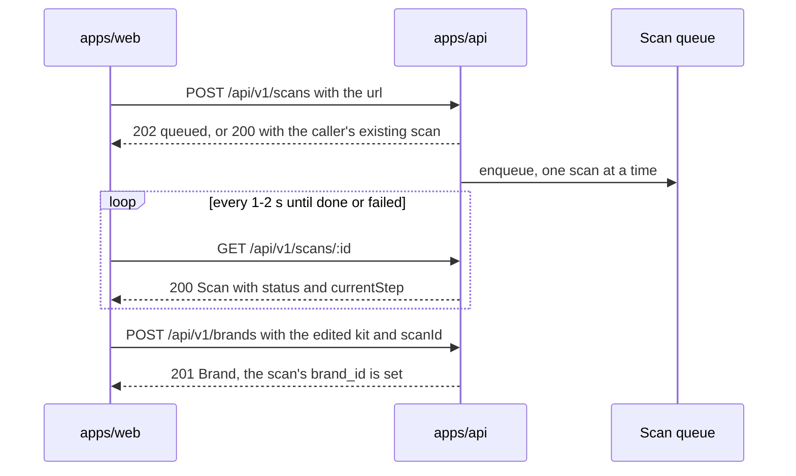
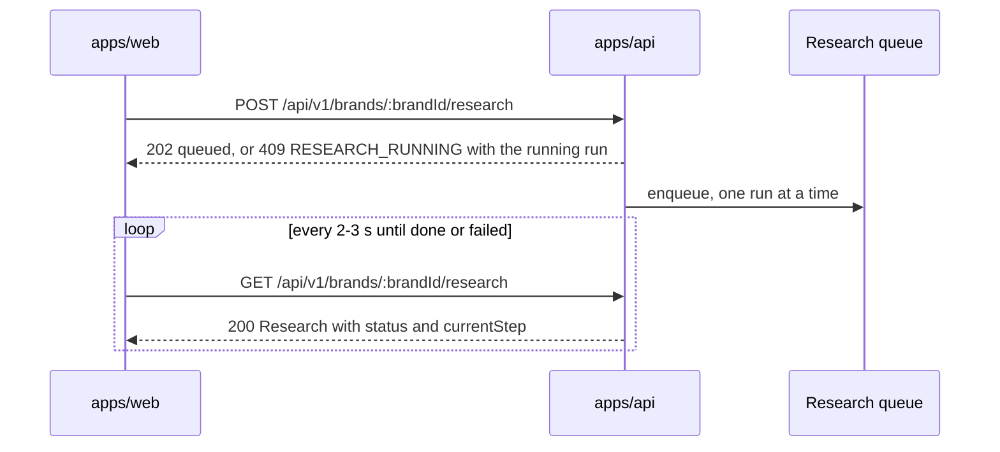

# API specification


*The HTTP contract of `apps/api`, for anyone calling the API or adding an endpoint.*

The API as it exists on 2026-09-22, the scan and research endpoints built today included. Routes are in
`apps/api/src/routes`, response shapes in `packages/shared/src/schema`. Each group below opens
with its index; the request and response detail sits in the fold under it.

<a id="contents"></a>

## Contents

- [1. Conventions](#1-conventions)
- [2. Errors](#2-errors)
- [3. Health](#3-health)
- [4. Me](#4-me)
- [5. Brands](#5-brands)
  - [5.1 Social accounts](#5-1-social-accounts)
- [6. Admin](#6-admin)
- [7. Scans](#7-scans)
- [8. Research](#8-research)
  - [8.1 Questionnaire](#8-1-questionnaire)
- [9. Planned endpoints](#9-planned-endpoints)
- [10. Keeping this file current](#10-keeping-this-file-current)
- [Related](#related)

<a id="1-conventions"></a>

## 1. Conventions

- **Base path** `/api/v1` (`src/routes/v1.route.ts`). Only `GET /health` sits outside it.
- **Auth.** Every `/api/v1` request needs a signed-in user. Send the Clerk session token as
  `Authorization: Bearer <token>`. `clerkAuth` (`src/auth/clerk.ts`) verifies it, then
  `requireUser` (`src/middlewares/auth.middleware.ts`) finds or creates our own `users` row and
  puts it on `req.user`.
- **Admin.** `/api/v1/admin/*` additionally requires `users.role = "admin"` (`requireAdmin`).
  Set `{ "role": "admin" }` in the person's Clerk public metadata; `ADMIN_EMAILS` is a
  development shortcut that also needs a verified primary email
  (`src/services/users.service.ts`).
- **Ids** are UUID strings. A malformed id answers `404`, not `400` (`isUuid` in
  `src/utils/index.ts`).
- **Timestamps** are ISO 8601 UTC strings, for example `"2026-09-22T12:30:00.000Z"`.
- **Content type** is JSON; the body limit is 1 MB (`src/app.ts`).

A success carries the envelope `{ "success": true, "data": { } }`. `DELETE` answers `204` with
no body. No endpoint paginates today.

<details>
<summary>Minting a token in development</summary>

In development `authorizedParties` is left undefined (`src/auth/clerk.ts`), so a token minted
with the Clerk Backend API is accepted. `pnpm --filter api run dev-token -- <email or user_...>`
(`apps/api/testing/dev-token.ts`) does exactly this and prints the token:

1. `POST https://api.clerk.com/v1/sessions` with `Authorization: Bearer <CLERK_SECRET_KEY>` and
   body `{ "user_id": "user_..." }`.
2. `POST https://api.clerk.com/v1/sessions/{id}/tokens` with the same header.
3. Use the returned `jwt` as the Bearer token.

The script takes an email or a Clerk user id; use an admin's email for admin endpoints.

</details>

> [!TIP]
> The secret stays in `apps/api/.env`; the script never writes a token to a file. With
> `NODE_ENV=production` only sessions issued to an origin in `CORS_ORIGINS` are accepted, and
> these tokens stop working.

<a id="2-errors"></a>

## 2. Errors

`errorMiddleware` (`src/middlewares/error.middleware.ts`) turns
`AppError(message, status, code, details?)` into:

```json
{ "success": false, "error": { "code": "BRAND_NOT_FOUND", "message": "This brand doesn't exist, or you don't have access to it." } }
```

A validation failure adds `details`, a list of `{ path, message }`
(`src/middlewares/validate.middleware.ts`):

```json
{ "success": false,
  "error": { "code": "VALIDATION_ERROR", "message": "Some fields are invalid.",
             "details": [ { "path": "url", "message": "Enter a website address such as acme.com" } ] } }
```

Fifteen codes are in use:

| Status         | Code                        | Message                                                                                   | Thrown by                                       |
| -------------- | --------------------------- | ----------------------------------------------------------------------------------------- | ----------------------------------------------- |
| ![400][st400]  | **`VALIDATION_ERROR`**      | Some fields are invalid.                                                                  | `validate.middleware.ts`                        |
| ![400][st400]  | **`INVALID_JSON`**          | The request body is not valid JSON.                                                       | `error.middleware.ts`                           |
| ![401][st401]  | **`UNAUTHENTICATED`**       | Sign in to continue.                                                                      | `auth.middleware.ts`                            |
| ![403][st403]  | **`FORBIDDEN`**             | Only an admin can do this.                                                                | `requireAdmin`                                  |
| ![403][st403]  | **`EMAIL_REQUIRED`**        | Your account has no email address. Add one, then try again.                               | `users.service.ts`                              |
| ![404][st404]  | **`BRAND_NOT_FOUND`**       | This brand doesn't exist, or you don't have access to it.                                 | `brands.service.ts`                             |
| ![404][st404]  | **`CLIENT_NOT_FOUND`**      | This client doesn't exist.                                                                | `admin-clients.service.ts`                      |
| ![404][st404]  | **`SCAN_NOT_FOUND`**        | This scan doesn't exist, or you don't have access to it.                                  | `scans.service.ts`                              |
| ![404][st404]  | **`ACCOUNT_NOT_FOUND`**     | This account is not connected.                                                            | `social-accounts.service.ts`                    |
| ![409][st409]  | **`CLIENT_EXISTS`**         | Someone with this email is already here.                                                  | `admin-clients.service.ts`                      |
| ![409][st409]  | **`EMAIL_IN_USE`**          | This email already belongs to another account. Verify your email address, then try again. | `users.service.ts`                              |
| ![409][st409]  | **`SCAN_NOT_DONE`**         | This scan hasn't finished yet.                                                            | `scans.service.ts`                              |
| ![400][st400]  | **`QUESTIONNAIRE_ANSWERS_INVALID`** | Some answers do not fit their questions. `details` names each one.                       | `questionnaire.service.ts`                             |
| ![400][st400]  | **`QUESTIONNAIRE_INCOMPLETE`**   | A required answer is still missing or unclear. `details` names the question ids when known. | `questionnaire.service.ts`                          |
| ![409][st409]  | **`QUESTIONNAIRE_REQUIRED`**     | Answer the questionnaire before research can start. Also sent when the questionnaire is not approved yet. | `research.service.ts`             |
| ![409][st409]  | **`QUESTIONNAIRE_NOT_STARTED`**  | Ask for the questionnaire first.                                                       | `questionnaire.service.ts`                             |
| ![409][st409]  | **`QUESTIONNAIRE_APPROVED`**     | The questionnaire is already approved.                                                           | `questionnaire.service.ts`                             |
| ![409][st409]  | **`QUESTIONNAIRE_SESSION_CHANGED`** | These questions were replaced. Reload them and answer again.                          | `questionnaire.service.ts`                             |
| ![502][st502]  | **`QUESTIONNAIRE_QUESTIONS_FAILED`** | We could not prepare your questions. Please try again.                                | `questionnaire.service.ts`                             |
| ![502][st502]  | **`QUESTIONNAIRE_REVIEW_FAILED`** | We could not check your answers. Please try again.                                      | `questionnaire.service.ts`                             |
| ![409][st409]  | **`RESEARCH_RUNNING`**      | Research is already running for this brand. The body also carries the running run in `data`. | `research.controller.ts`                     |
| ![502][st502]  | **`INVITE_FAILED`**         | The invitation email could not be sent. Try again.                                        | `admin-clients.service.ts`                      |
| ![501][st501]  | **`PLATFORM_NOT_AVAILABLE`** | Connecting <platform> is not available yet.                                              | `social-accounts.service.ts`                    |
| ![500][st500]  | **`INTERNAL_SERVER_ERROR`** | Something went wrong                                                                      | `error.middleware.ts` (details stay in the log) |

`401 UNAUTHENTICATED` and `500 INTERNAL_SERVER_ERROR` are possible on every `/api/v1` endpoint
and are not repeated in the group indexes. `403 FORBIDDEN` is possible on every `/admin`
endpoint.

<a id="3-health"></a>

## 3. Health

| Method      | Path      | Who              | Answers                       |
| ----------- | --------- | ---------------- | ----------------------------- |
| ![GET][get] | `/health` | anyone, no token | ![200][st200] ![503][st503]   |

<details>
<summary>GET /health</summary>

Input: none. Runs `select 1` against Postgres (`src/services/health.service.ts`). `200` when
the database answers, `503` with `"success": false` when it does not:

```json
{ "success": true, "data": { "status": "healthy", "database": "up", "timestamp": "2026-09-22T10:00:00.000Z" } }
```

</details>

> [!WARNING]
> `GET /health/test-error` also exists: it throws `400 TEST_ERROR` on purpose. It is a
> developer tool and should be removed before production.

<a id="4-me"></a>

## 4. Me

| Method      | Path                  | Who                | Answers                                     |
| ----------- | --------------------- | ------------------ | ------------------------------------------- |
| ![GET][get] | `/api/v1/me`          | any signed-in user | ![200][st200] ![403][st403] ![409][st409]   |
| ![GET][get] | `/api/v1/me/overview` | any signed-in user | ![200][st200] ![403][st403] ![409][st409]   |

<details>
<summary>GET /api/v1/me</summary>

Input: none. The first call ever creates the `users` row, or links an invited row by verified
email. `200`, shape `meSchema` (`packages/shared/src/schema/me.schema.ts`):

```json
{ "success": true, "data": {
  "id": "7d1f0c6e-2a8b-4a63-9a57-0f2f1b6d3c11",
  "email": "owner@crumbandco.com",
  "name": "Asha Kulkarni",
  "imageUrl": "https://img.clerk.com/demo-avatar",
  "role": "client",
  "createdAt": "2026-09-20T10:15:00.000Z"
} }
```

Errors: `409 EMAIL_IN_USE`, `403 EMAIL_REQUIRED`.

</details>

<details>
<summary>GET /api/v1/me/overview</summary>

Input: none. Everything the first screen needs in one request. `200`, shape
`meOverviewSchema`: `{ user: Me, brands: Brand[], counts: { brands: number } }`. `brands` holds
only the brands **this person owns**, even for an admin (`MeService.overview` calls
`BrandsService.listOwnedBy`). An empty list means they have not onboarded yet.

Errors: as `GET /me`.

</details>

<a id="5-brands"></a>

## 5. Brands

| Method            | Path                 | Who                | Answers                                                     |
| ----------------- | -------------------- | ------------------ | ----------------------------------------------------------- |
| ![GET][get]       | `/api/v1/brands`     | owner, or an admin | ![200][st200]                                               |
| ![POST][post]     | `/api/v1/brands`     | any signed-in user | ![201][st201] ![400][st400] ![404][st404] ![409][st409]     |
| ![GET][get]       | `/api/v1/brands/:id` | owner, or an admin | ![200][st200] ![404][st404]                                 |
| ![PATCH][patch]   | `/api/v1/brands/:id` | owner, or an admin | ![200][st200] ![400][st400] ![404][st404]                   |
| ![DELETE][delete] | `/api/v1/brands/:id` | owner, or an admin | ![204][st204] ![404][st404]                                 |

> [!IMPORTANT]
> **Who may call.** A client reaches only brands where `owner_id` is their user id; an admin
> reaches every brand (`scopeFor`). Archived brands are invisible to every query.

<details>
<summary>The Brand shape</summary>

`Brand` is `brandSchema` (`packages/shared/src/schema/brand.schema.ts`), mapped from the row by
`toBrand` in `src/services/brands.service.ts`:

```json
{
  "id": "b3c1f1de-5e0a-4f0e-8f65-6d1f4a2c9e77",
  "ownerId": "7d1f0c6e-...", "createdBy": "7d1f0c6e-...",
  "name": "Crumb & Co", "url": "https://crumbandco.com", "industry": "Bakery",
  "accent": "#3B2F2F", "status": "active", "stage": "onboarding",
  "brand": { "tagline": "Small-batch bakes, made before sunrise", "summary": "...", "audience": "...",
             "voice": ["warm", "direct"], "colors": [ { "name": "Espresso", "hex": "#3B2F2F" } ],
             "fonts": { "heading": "Fraunces", "body": "Inter" },
             "aesthetic": "earthy", "keywords": ["sourdough"] },
  "business": { "phone": "+91 98765 43210", "email": "hello@crumbandco.com",
                "location": { "city": "Pune", "country": "India" },
                "hours": [ { "day": "mon", "open": "07:00", "close": "19:00" } ] },
  "platforms": ["instagram", "linkedin", "tiktok"],
  "accounts": [],
  "preferences": { "timezone": "UTC", "approvalEmails": true },
  "questionnaire": null,
  "createdAt": "2026-09-20T16:40:12.345Z",
  "stats": { "followers": 0, "followersDelta": 0, "engagementRate": 0,
             "engagementDelta": 0, "scheduled": 0, "pendingApprovals": 0 }
}
```

`accounts` is always `[]` and `stats` always zeros until phases 3 and 5; the shape does not
change. `accent` is always the first brand colour, or `DEFAULT_ACCENT`, `#4B3FE4`. `stage` is
never set by a caller.

</details>

<details>
<summary>GET /api/v1/brands, and GET /api/v1/brands/:id</summary>

The list returns the brands the caller can reach, newest first. Input: none. `200`: `Brand[]`.

The single read answers `200` with a `Brand`. Errors: `404 BRAND_NOT_FOUND`.

</details>

<details>
<summary>POST /api/v1/brands</summary>

Create a brand owned by the caller. Body `newBrandSchema`:

| Field           | Required | Note                                                                       |
| --------------- | -------- | -------------------------------------------------------------------------- |
| **`name`**      | yes      | trimmed, non-empty                                                         |
| **`url`**       | yes      | `websiteUrlSchema` — `"crumbandco.com"` becomes `"https://crumbandco.com"` |
| **`industry`**  | yes      | may be `""`                                                                |
| **`brand`**     | yes      | full `BrandKit`                                                            |
| **`platforms`** | yes      | may be `[]`                                                                |
| **`business`**  | no       | `BusinessInfo`                                                             |
| **`scanId`**    | no       | uuid of the scan this brand came from                                      |

`201`: the new `Brand`. `createdBy` equals `ownerId`.

Errors: `400 VALIDATION_ERROR`; with `scanId`: `404 SCAN_NOT_FOUND` (missing, or not the
caller's and the caller is not an admin), `409 SCAN_NOT_DONE` (still queued or running). On
success the scan's `brand_id` is set (`ScansRepository.attachBrand`).

</details>

<details>
<summary>PATCH /api/v1/brands/:id, and DELETE /api/v1/brands/:id</summary>

`PATCH` takes `brandPatchSchema`, all optional, unknown keys dropped: `name`, `industry`,
`brand`, `business`, `platforms`, `preferences`, `questionnaire`. Changing `brand` recomputes `accent`. `200`:
the updated `Brand`. Errors: `400 VALIDATION_ERROR`, `404 BRAND_NOT_FOUND`.

`DELETE` archives the brand (`status` becomes `archived`, `archived_at` records when); nothing is deleted. `204`, no body. Errors:
`404 BRAND_NOT_FOUND`, including when it is already archived.

</details>

<a id="5-1-social-accounts"></a>

### 5.1 Social accounts

Built on 2026-09-23 for Instagram (Meta's "Instagram API with Instagram Login": the person signs
in with the Instagram professional account itself, no Facebook Page). The other three platforms
answer `501` until their apps exist. One account per platform per brand, so the platform name is
the key in the URL.

| Method            | Path                                                | Who                | Answers                                                   |
| ----------------- | --------------------------------------------------- | ------------------ | --------------------------------------------------------- |
| ![GET][get]       | `/api/v1/brands/:brandId/social-accounts`           | owner, or an admin | ![200][st200] ![404][st404]                               |
| ![POST][post]     | `/api/v1/brands/:brandId/social-accounts/connect`   | owner, or an admin | ![200][st200] ![400][st400] ![404][st404] ![501][st501]   |
| ![GET][get]       | `/api/v1/oauth/:platform/callback`                  | the browser, no token | ![302][st302]                                          |
| ![DELETE][delete] | `/api/v1/brands/:brandId/social-accounts/:platform` | owner, or an admin | ![204][st204] ![400][st400] ![404][st404]                 |

<details>
<summary>The SocialAccountDetail shape</summary>

`socialAccountDetailSchema` (`packages/shared/src/schema/social.schema.ts`), mapped by
`toDetail` in `src/services/social-accounts.service.ts`. **Never in any output:**
`access_token_enc`, `refresh_token_enc`, `meta`, `external_account_id`.

```json
{
  "id": "a1b2c3d4-...", "platform": "instagram", "handle": "kilncoffee",
  "avatarUrl": "https://scontent.cdninstagram.com/...", "status": "connected",
  "scopes": ["instagram_business_basic", "instagram_business_content_publish", "instagram_business_manage_insights"],
  "tokenExpiresAt": "2026-11-22T09:00:00.000Z",
  "connectedBy": "7d1f0c6e-...", "connectedAt": "2026-09-23T09:00:00.000Z", "lastSyncedAt": null
}
```

`status` is `connected`, `expired` or `disconnected`. The short form inside `Brand.accounts`
stays `{ platform, handle, status, connectedAt }` and lists only `connected` and `expired` rows.

</details>

<details>
<summary>GET /api/v1/brands/:brandId/social-accounts</summary>

Every row for the brand, `disconnected` included, ordered by platform. `200`:
`SocialAccountDetail[]`. Errors: `404 BRAND_NOT_FOUND` (missing, archived, or not yours).

</details>

<details>
<summary>POST /api/v1/brands/:brandId/social-accounts/connect, and the callback</summary>

Body `connectSocialAccountSchema`: `{ "platform": "instagram" }`. The API signs a `state`
(brand id, user id, platform, nonce, 10-minute expiry; HMAC-SHA256, `src/social/state.ts`) and
answers `200`:

```json
{ "authorizeUrl": "https://www.instagram.com/oauth/authorize?client_id=...&redirect_uri=...&response_type=code&scope=instagram_business_basic,instagram_business_content_publish,instagram_business_manage_insights&state=..." }
```

The web app sets `window.location = authorizeUrl`. Reconnecting uses this same call; the
callback then overwrites the brand's row for that platform.

Meta sends the browser to `GET /api/v1/oauth/instagram/callback?code=...&state=...` (or
`?error=access_denied&state=...`). That route is mounted outside the `/api/v1` auth chain
(`src/app.ts`): a redirect carries no Bearer token, so the signed `state` is the identity. The
API swaps the code for a 60-day token (three Meta calls: code to short-lived token, exchange for
long-lived, read the profile; `createInstagramProvider` in `packages/social-connect`), encrypts the
token with AES-256-GCM (`src/social/crypto.ts`),
upserts `social_accounts` with `status: "connected"`, and always answers `302`, never JSON:

- success: `<FRONTEND_URL>/c/<brandId>/settings?tab=accounts&connected=instagram`
- failure: `<FRONTEND_URL>/c/<brandId>/settings?tab=accounts&connect_error=<code>`
- no usable `state`: `<FRONTEND_URL>/?connect_error=invalid_state`

`connect_error` codes: `denied` (the person said no), `invalid_state` (missing, tampered,
older than ten minutes, or for another platform), `missing_scopes` (a permission was refused),
`account_mismatch` (a reconnect chose a different Instagram account), `account_in_use` (that
Instagram account already belongs to another brand), `failed` (Meta or the database said no;
the reason is in the API log, never in the URL).

Errors on `connect`: `400 VALIDATION_ERROR` (unknown platform), `404 BRAND_NOT_FOUND`,
`501 PLATFORM_NOT_AVAILABLE` (no app for the platform, or `SOCIAL_TOKEN_KEY`,
`INSTAGRAM_APP_ID` or `INSTAGRAM_APP_SECRET` unset).

</details>

<details>
<summary>DELETE /api/v1/brands/:brandId/social-accounts/:platform</summary>

Disconnects: both token columns become null, `status` becomes `disconnected`, the row stays
because metric history hangs off it. `204`, no body. Errors: `400 VALIDATION_ERROR` (unknown
platform), `404 BRAND_NOT_FOUND`, `404 ACCOUNT_NOT_FOUND` (never connected, or already
disconnected). The token is not revoked on Meta's side.

</details>

<details>
<summary>Token refresh</summary>

Long-lived Instagram tokens last 60 days and can be refreshed once they are a day old
(`provider.refresh(token)` in `packages/social-connect`). The daily job that calls it, marks
overdue rows `expired` and writes the new token back is task 5-3, which waits on decision D-6
(always-on process or not). Not built yet.

</details>

<a id="6-admin"></a>

## 6. Admin

All four sit behind `requireAdmin` (`src/routes/admin.route.ts`). "Clients" here are people.

| Method        | Path                               | Who   | Answers                                                     |
| ------------- | ---------------------------------- | ----- | ----------------------------------------------------------- |
| ![GET][get]   | `/api/v1/admin/clients`            | admin | ![200][st200]                                               |
| ![GET][get]   | `/api/v1/admin/clients/:id`        | admin | ![200][st200] ![404][st404]                                 |
| ![POST][post] | `/api/v1/admin/clients`            | admin | ![201][st201] ![400][st400] ![409][st409] ![502][st502]     |
| ![POST][post] | `/api/v1/admin/clients/:id/brands` | admin | ![201][st201] ![400][st400] ![404][st404] ![409][st409]     |

For every other brand action an admin uses the ordinary `/brands/...` endpoints; the ownership
rule already lets them reach every brand.

<details>
<summary>The AdminClient shape</summary>

`AdminClient` is `adminClientSchema` (`packages/shared/src/schema/admin.schema.ts`):

```json
{ "id": "e4f5a6b7-...", "email": "new.person@example.com", "name": "New Person",
  "imageUrl": null, "phone": "+91 98000 00000", "status": "invited",
  "brandCount": 0, "createdAt": "2026-09-20T10:00:00.000Z" }
```

`status` is `invited` until the first sign-in, then `active`. `brandCount` ignores archived
brands.

</details>

<details>
<summary>GET /api/v1/admin/clients, and GET /api/v1/admin/clients/:id</summary>

The list returns every client, newest first; admins are not listed. Input: none. `200`:
`AdminClient[]`. Not paginated yet.

The single read answers `200` with `adminClientDetailSchema`:
`{ "client": AdminClient, "brands": Brand[] }`, the brands that client owns. Errors:
`404 CLIENT_NOT_FOUND`, which is also the answer when the id belongs to an admin.

</details>

<details>
<summary>POST /api/v1/admin/clients</summary>

Invite a client before they have an account. Body `inviteClientSchema`: `email` (required,
trimmed, lowercased), `name` (optional), `phone` (optional).

Creates a `users` row with `status = "invited"` and no `clerk_id`, then asks Clerk to send a
real invitation email, redirecting to `${CORS_ORIGINS[0]}/sign-up`. If the email cannot be sent
the row is deleted again.

`201`: `AdminClient`. Errors: `400 VALIDATION_ERROR`, `409 CLIENT_EXISTS`, `502 INVITE_FAILED`.

</details>

<details>
<summary>POST /api/v1/admin/clients/:id/brands</summary>

The admin sets up a brand for a client. Body: the same `newBrandSchema` as `POST /brands`,
`scanId` included. The client becomes `ownerId`; the admin is recorded as `createdBy`.

`201`: `Brand`. Errors: `400 VALIDATION_ERROR`, `404 CLIENT_NOT_FOUND`, plus the `scanId`
errors above.

</details>

<a id="7-scans"></a>

## 7. Scans

| Method        | Path                | Who                | Answers                                     |
| ------------- | ------------------- | ------------------ | ------------------------------------------- |
| ![POST][post] | `/api/v1/scans`     | any signed-in user | ![202][st202] ![200][st200] ![400][st400]   |
| ![GET][get]   | `/api/v1/scans/:id` | requester or admin | ![200][st200] ![404][st404]                 |

Built on 2026-09-22 to
[`2026-09-22-scan-endpoints-design.md`](./superpowers/specs/2026-09-22-scan-endpoints-design.md),
in `src/routes/scans.route.ts`, `src/controllers/scans.controller.ts`,
`src/services/scans.service.ts`, `src/repositories/scans.repository.ts` and
`src/scan-queue/index.ts`. Live; not committed yet.

A scan runs **before** the brand exists, so it is not nested under a brand. It is reachable by
the user who requested it and by admins.



*Onboarding end to end: two scan calls and the brand create that closes the loop.*

> [!NOTE]
> Verified over HTTP on 2026-09-22, 8 of 8 checks: `queued` to `running` with the real step ids
> to `done`; a second `POST` returns the running scan with `200`; `127.0.0.1` fails as
> `BLOCKED_ADDRESS`; another user gets `404` and an admin `200`; a brand created from a scan is
> linked; `409 SCAN_NOT_DONE` and `404 SCAN_NOT_FOUND` behave; a hard kill logs
> `Marked 1 interrupted scan(s) as failed`.

<details>
<summary>The Scan shape</summary>

`Scan` is `scanSchema` (`packages/shared/src/schema/scan.schema.ts`):

```json
{ "id": "d4e5f6a7-...", "brandId": null, "url": "https://donangie.com",
  "status": "running", "currentStep": "read-pages",
  "pages": [ { "url": "https://donangie.com/about", "title": "About us" } ],
  "result": null, "error": null,
  "startedAt": "2026-09-22T09:00:01.000Z", "finishedAt": null,
  "createdAt": "2026-09-22T09:00:00.000Z" }
```

- `status`: `queued` | `running` | `done` | `failed`.
- `currentStep`: `discover` | `read-pages` | `interpret` | `report`, or null before the start
  and after the end. These are the workflow's real step ids, replacing the catalogue's older
  `fetch | visual | voice | audience`; the web app maps ids to labels.
- `result` is a `ScanResult` (`{ name?, industry?, brand: BrandKit, business? }`) when `done`.
- `error` is a plain sentence, written for a business owner, when `failed`. Show it as it is.

</details>

<details>
<summary>POST /api/v1/scans</summary>

Start a website scan. Who: any signed-in user, an admin included. Body `newScanSchema`:
`{ "url": "donangie.com" }`, the same rule as a brand's `url`.

- `202`: a new `Scan` with `status: "queued"` and `currentStep: null`.
- `200`: the caller's **existing** queued or running scan, returned instead of starting a
  second one. A double click must not spend two Firecrawl calls.

Errors: `400 VALIDATION_ERROR`.

</details>

<details>
<summary>GET /api/v1/scans/:id</summary>

Poll the scan; the web app calls it every 1 to 2 seconds until `status` is `done` or `failed`.
Who: the requester, or an admin. `200`: `Scan`. When done:

```json
{ "success": true, "data": {
  "id": "d4e5f6a7-...", "status": "done", "currentStep": null,
  "pages": [ { "url": "https://donangie.com/", "title": "Don Angie" } ],
  "result": { "name": "Don Angie", "industry": "Italian restaurant",
              "brand": { "...": "BrandKit" },
              "business": { "phone": "(212) 889-8884", "location": { "address": "103 Greenwich Ave" } } },
  "startedAt": "2026-09-22T09:00:01.000Z", "finishedAt": "2026-09-22T09:00:42.000Z"
} }
```

A failure is still `200` with `status: "failed"` and, for example,
`"error": "We can only read public websites. Check the address and try again."`.

Errors: `404 SCAN_NOT_FOUND`, meaning missing, or requested by someone else and the caller is
not an admin.

</details>

There is no third scan endpoint. The person edits the proposed kit in the browser, then calls
`POST /brands` (or the admin version) with the edited kit and the `scanId`.

<a id="8-research"></a>

## 8. Research

| Method        | Path                                | Who                | Answers                                                   |
| ------------- | ----------------------------------- | ------------------ | --------------------------------------------------------- |
| ![POST][post] | `/api/v1/brands/:brandId/research`  | owner, or an admin | ![202][st202] ![404][st404] ![409][st409]                 |
| ![GET][get]   | `/api/v1/brands/:brandId/research`  | owner, or an admin | ![200][st200] ![404][st404]                               |

Built on 2026-09-22 to
[`2026-09-22-business-discovery-design.md`](./superpowers/specs/2026-09-22-business-discovery-design.md),
in `src/routes/research.route.ts` (mounted from `brands.route.ts`),
`src/controllers/research.controller.ts`, `src/services/research.service.ts`,
`src/repositories/research.repository.ts` and `src/research-queue/index.ts`. The run itself is
`runBusinessDiscovery` (`src/mastra/workflows/business-discovery/run.ts`): the Growth Consultant
writes a growth brief, the Audience Researcher an audience profile, both from the brand kit, the
owner's questionnaire answers, the linked scan's facts and live web research. Awaiting migration `0004`
(tables `research_runs`, `brand_research`, column `brands.questionnaire`) before it can be tried live.

Research is **versioned, never edited**: every finished run writes the next `version` of each
kind. One active run per brand; one run at a time in the process, as with scans.



*Onboarding calls `POST …/research` right after `POST /brands` (with `questionnaire`); the Strategy screen polls.*

<details>
<summary>The Research shape</summary>

`Research` is `researchSchema` (`packages/shared/src/schema/research.schema.ts`), mapped by
`toResearch` in `src/services/research.service.ts`:

```json
{ "brandId": "b1c2d3e4-...",
  "status": "running", "currentStep": "diagnose", "error": null,
  "growthBrief": { "version": 1, "content": { "...": "GrowthBrief" },
                   "sources": [ "https://fourbarrelcoffee.com/", "https://www.yelp.com/biz/four-barrel-coffee-san-francisco" ],
                   "createdAt": "2026-09-22T10:00:00.000Z" },
  "audienceProfile": null,
  "startedAt": "2026-09-22T10:20:01.000Z", "finishedAt": null }
```

- `status`: `queued` | `running` | `done` | `failed`, or **null when research never ran** for
  this brand. `currentStep`, `error`, `startedAt` and `finishedAt` describe the latest run.
- `currentStep`: `gather` | `diagnose` | `profile` | `save`, or null before the start and after
  the end. These are the workflow's real step ids; the web app maps ids to labels.
- `growthBrief` and `audienceProfile` are the **latest stored versions**, whatever the latest
  run's status; null until a run has finished once. `content` is a `GrowthBrief` or an
  `AudienceProfile`; `sources` lists the URLs the agent's tools actually read.
- `error` is a plain sentence, written for a business owner, when `failed`. Show it as it is.

</details>

<details>
<summary>POST /api/v1/brands/:brandId/research</summary>

Start business discovery for a brand. Who: the owner, or an admin. No body.

- `202`: `Research` with `status: "queued"` and `currentStep: null` (plus the previous
  versions, if any).
- `409 QUESTIONNAIRE_REQUIRED`: `brands.questionnaire` is null. Send the questionnaire answers with `POST /brands`
  or `PATCH /brands/:id` first.
- `409 RESEARCH_RUNNING`: the brand already has a queued or running run. The body is the usual
  error envelope **plus** `data`, the running `Research`, so a double click can start polling:

```json
{ "success": false,
  "error": { "code": "RESEARCH_RUNNING", "message": "Research is already running for this brand." },
  "data": { "brandId": "b1c2d3e4-...", "status": "running", "currentStep": "profile", "...": "Research" } }
```

Errors: `404 BRAND_NOT_FOUND` (missing, archived, or not the caller's).

</details>

<details>
<summary>GET /api/v1/brands/:brandId/research</summary>

Poll the research; the web app calls it every 2 to 3 seconds until `status` is `done` or
`failed`. Who: the owner, or an admin. `200`: `Research`. A brand that never ran research
answers `200` with `status: null` and both documents null; a failure is still `200` with
`status: "failed"` and, for example,
`"error": "We could not finish researching your business. Please try again."` or, after a
restart mid-run, `"error": "The research was interrupted. Please try again."`.

Errors: `404 BRAND_NOT_FOUND`.

</details>

<a id="8-1-questionnaire"></a>

### 8.1 Questionnaire

The Account Manager's guided questionnaire (spec `docs/superpowers/specs/2026-09-25-guided-questionnaire-design.md`). After the brand kit is saved, the owner picks a chat language, the Account Manager writes 5-8 questions for this brand (the five required facts plus 2-4 brand-only questions from the gaps the scan left), the owner answers them, and the Account Manager reviews the answers. **Its approval starts research; without it, `POST .../research` answers 409 `QUESTIONNAIRE_REQUIRED`.** Admins go through exactly the same flow.

| Method | Path | Who | Answers |
|---|---|---|---|
| ![GET][get]   | `/api/v1/brands/:brandId/questionnaire`           | owner, or an admin | ![200][st200] ![404][st404] |
| ![POST][post] | `/api/v1/brands/:brandId/questionnaire/questions` | owner, or an admin | ![200][st200] ![400][st400] ![404][st404] ![409][st409] ![502][st502] |
| ![PUT][put]   | `/api/v1/brands/:brandId/questionnaire/answers`   | owner, or an admin | ![200][st200] ![400][st400] ![404][st404] ![409][st409] |
| ![POST][post] | `/api/v1/brands/:brandId/questionnaire/submit`   | owner, or an admin | ![200][st200] ![400][st400] ![404][st404] ![409][st409] ![502][st502] |

Code: `src/routes/questionnaire.route.ts` (mounted from `brands.route.ts`), `src/controllers/questionnaire.controller.ts`, `src/services/questionnaire.service.ts`. The agent is `createAccountManager` in `packages/agents`, with the skill `packages/agents/skills/questionnaire-interview`. Shapes: `packages/shared/src/schema/questionnaire.schema.ts`. Both model calls run inside the request (about 15-60 s each).

<details>
<summary>POST /api/v1/brands/:brandId/questionnaire/questions</summary>

Body `{ "chatLanguage": "en" | "hi" | "hinglish" }`. Writes the questions once per language and stores them in `brands.questionnaire_session` (and `preferences.chatLanguage`); asking again in the same language returns the stored ones without a model call, a new language starts the questionnaire again. Code checks every list before it is stored: 5-8 questions, the five required facts (`offer`, `businessType`, `goal`, `postLanguage`, `idealCustomer`) covered, at most 14 words each, options on choice and range questions, a currency on ranges. A list that fails twice answers 502 `QUESTIONNAIRE_QUESTIONS_FAILED`; the owner never sees it.

`200` `{ "success": true, "data": QuestionnaireSession }`: `{ sessionId, chatLanguage, questions: QuestionnaireQuestion[], answers, followUps, updatedAt }`. Keep `sessionId`: answers and approval must send it, so a screen still holding an older list (another language, another tab) is refused with 409 `QUESTIONNAIRE_SESSION_CHANGED` instead of answering the wrong questions. An `QuestionnaireQuestion` is `{ id, covers: QuestionnaireKey[], why, kind: "confirm" | "choice" | "text" | "range", text, example?, options?: { value, label, min?, max? }[], prefill?, required, currency? }`. The screen shows `prefill` above a confirm question's `text`.

Errors: `404 BRAND_NOT_FOUND`, `409 QUESTIONNAIRE_APPROVED`, `502 QUESTIONNAIRE_QUESTIONS_FAILED`.

</details>

<details>
<summary>GET /api/v1/brands/:brandId/questionnaire</summary>

`200` `{ status: "not_started" | "in_progress" | "approved", session: { chatLanguage, questions, answers, followUps, updatedAt } | null, approvedAt: string | null }`.

</details>

<details>
<summary>PUT /api/v1/brands/:brandId/questionnaire/answers</summary>

Body `{ "sessionId": "<uuid>", "answers": { "<questionId>": "<value>" } }`, one or many at a time; later calls merge. A value is the option `value` for choice and range questions, `"yes"` or the owner's fix for a confirm question, free text otherwise, or `"not_sure"` for an optional question. Nothing is saved when any answer does not fit.

`200` the questionnaire state, as `GET`.

Errors: `400 QUESTIONNAIRE_ANSWERS_INVALID` (unknown id, empty, `not_sure` on a required question, a value not among the options), `409 QUESTIONNAIRE_NOT_STARTED`, `409 QUESTIONNAIRE_APPROVED`, `409 QUESTIONNAIRE_SESSION_CHANGED`.

</details>

<details>
<summary>POST /api/v1/brands/:brandId/questionnaire/submit</summary>

Body `{ "sessionId": "<uuid>" }` (optional only for a questionnaire edited in Settings, which has no session to answer). Checks every required question has an answer (`400 QUESTIONNAIRE_INCOMPLETE` with the ids), then the Account Manager reviews the answers and reads the facts out of them. Facts the owner **tapped** (business type, post language, goal, the money range with its numbers and currency) are taken from the answers by code, never from the model's reading.

- **Approved:** `{ approved: true, research }`. The questionnaire is saved to `brands.questionnaire` (validated by `questionnaireSchema`), `questionnaireApprovedAt` is set, research is queued (`research` as `GET .../research`). The approval is written only if nobody approved first, and the database allows one active research run per brand, so two approvals at once start one run; both answer `approved: true`.
- **Not approved, first review:** `{ approved: false, final: false, reason, followUps: QuestionnaireQuestion[], reopen: [] }` with 1-3 follow-ups (checked like the first questions). Answer them with `PUT .../answers` and submit again.
- **Not approved, final review:** `{ approved: false, final: true, reason, followUps: [], reopen: ["q4", "f1"] }`: no new questions; show the `reopen` questions again with the `reason`, let the owner change those answers, and submit again.
- **Already approved:** `{ approved: true, research }`, and nothing new starts.

**Edited in Settings:** `PATCH /brands/:id` with `questionnaire` clears `questionnaireApprovedAt` (research answers 409 until approved again). Submitting then reviews the owner's edited questionnaire and, when approved, keeps it exactly as they wrote it; when not, answers `{ approved: false, final: true, reason, followUps: [], reopen: [] }` and the owner fixes it in Settings.

Errors: `400 QUESTIONNAIRE_INCOMPLETE`, `409 QUESTIONNAIRE_NOT_STARTED`, `409 QUESTIONNAIRE_SESSION_CHANGED`, `502 QUESTIONNAIRE_REVIEW_FAILED`.

</details>

<a id="9-planned-endpoints"></a>

## 9. Planned endpoints

The full catalogue is
[`2026-09-20-api-endpoints-catalogue.md`](./superpowers/specs/2026-09-20-api-endpoints-catalogue.md),
which carries request and response shapes for the original 39; the research pair above was
added on 2026-09-22 and the four questionnaire endpoints on 2026-09-25, making 45. Twenty-four are live:
the 12 from phase 1, the 2 scans, the 2 research endpoints, the 4 questionnaire endpoints and the 4
social account endpoints.

| Phase                                   | Endpoints | Built          |
| --------------------------------------- | --------- | -------------- |
| **1 — foundation**                      | 12        | ![100%][pr100] |
| **2 — scan, research and strategy**     | 13        | ![62%][pr62]   |
| **3 — posts**                           | 10        | ![0%][pr0]     |
| **4 — chat**                            | 3         | ![0%][pr0]     |
| **5 — accounts, publishing, analytics** | 7         | ![57%][pr57]   |
| **everything**                          | 45        | ![53%][pr53]   |

<details>
<summary>What the remaining 21 are, by phase and group</summary>

| Phase | Group           | Endpoints                                                                                                                                                                        |
| ----- | --------------- | -------------------------------------------------------------------------------------------------------------------------------------------------------------------------------- |
| **2** | Strategy        | `GET /brands/:brandId/strategy`, `GET\|POST /brands/:brandId/strategies`, `GET /brands/:brandId/strategies/:strategyId`, `POST /brands/:brandId/strategies/:strategyId/activate` |
| **3** | Posts           | list, `generate`, get one, `PATCH`, `approve`, `reject`, `request-changes`, `reopen`, media upload, media delete (10)                                                            |
| **4** | Chat            | `POST /brands/:brandId/chat` (SSE stream, the one response without the `{ success, data }` envelope), thread list, thread messages                                               |
| **5** | Publishing      | `POST /brands/:brandId/posts/:postId/publish`                                                                                                                                    |
| **5** | Analytics       | `GET /brands/:brandId/analytics`, `GET /brands/:brandId/audience`                                                                                                                |

</details>

<details>
<summary>The twelve error codes those phases add</summary>

`STRATEGY_NOT_FOUND`, `STRATEGY_NOT_DRAFT`, `STRATEGY_DRAFT_EXISTS`, `NO_ACTIVE_STRATEGY`,
`POST_NOT_FOUND`, `INVALID_POST_STATE`, `MEDIA_NOT_FOUND`, `MEDIA_TOO_LARGE`,
`UNSUPPORTED_MEDIA`, `ACCOUNT_NOT_CONNECTED`,
`THREAD_NOT_FOUND`, `AGENT_FAILED`.

</details>

Much work has no endpoint on purpose: publishing due posts, fetching metrics, refreshing
tokens, writing learnings and activating a strategy after its 30-minute window are background
jobs (catalogue §12, §14).

<a id="10-keeping-this-file-current"></a>

## 10. Keeping this file current

There is no generated collection any more (Postman was removed on 2026-09-22). Until the OpenAPI
registry on `feature/openapi` is merged, this file is the contract: an endpoint change updates
its table row and shapes here in the same change ([`apps/api/AGENTS.md`](../apps/api/AGENTS.md)).
The 17 routes are the 16 endpoints above plus the developer-only `GET /health/test-error`.

<a id="related"></a>

## Related

- [PRD.md](./PRD.md) sets out what the product must do.
- [ARCHITECTURE.md](./ARCHITECTURE.md) describes how the system is built.
- [SECURITY.md](./SECURITY.md) holds the threat model and the controls.
- [DESIGN.md](./DESIGN.md) is the design system.
- [TASKS.md](./TASKS.md) is the board.
- [LESSION.md](./LESSION.md) collects the lessons learned.
- [MEMORY.md](./MEMORY.md) is the brief to load first every session.

<!-- Method, status-code and progress badges. Progress is an uptime-style bar: green for the built share. -->

[get]: https://img.shields.io/badge/-GET-blue
[put]: https://img.shields.io/badge/-PUT-orange
[post]: https://img.shields.io/badge/-POST-brightgreen
[patch]: https://img.shields.io/badge/-PATCH-yellow
[delete]: https://img.shields.io/badge/-DELETE-red
[st200]: https://img.shields.io/badge/-200-brightgreen
[st201]: https://img.shields.io/badge/-201-brightgreen
[st202]: https://img.shields.io/badge/-202-green
[st204]: https://img.shields.io/badge/-204-brightgreen
[st400]: https://img.shields.io/badge/-400-orange
[st401]: https://img.shields.io/badge/-401-orange
[st403]: https://img.shields.io/badge/-403-orange
[st404]: https://img.shields.io/badge/-404-orange
[st409]: https://img.shields.io/badge/-409-orange
[st302]: https://img.shields.io/badge/-302-blue
[st501]: https://img.shields.io/badge/-501-orange
[st500]: https://img.shields.io/badge/-500-red
[st502]: https://img.shields.io/badge/-502-red
[st503]: https://img.shields.io/badge/-503-red
[pr0]: https://img.shields.io/badge/%20-%7C%7C%7C%7C%7C%7C%7C%7C%7C%7C%200%25-lightgrey?style=flat-square&labelColor=lightgrey
[pr29]: https://img.shields.io/badge/%7C%7C%7C-%7C%7C%7C%7C%7C%7C%7C%2029%25-lightgrey?style=flat-square&labelColor=brightgreen
[pr36]: https://img.shields.io/badge/%7C%7C%7C%7C-%7C%7C%7C%7C%7C%7C%2036%25-lightgrey?style=flat-square&labelColor=brightgreen
[pr44]: https://img.shields.io/badge/%7C%7C%7C%7C-%7C%7C%7C%7C%7C%7C%2044%25-lightgrey?style=flat-square&labelColor=brightgreen
[pr49]: https://img.shields.io/badge/%7C%7C%7C%7C%7C-%7C%7C%7C%7C%7C%2049%25-lightgrey?style=flat-square&labelColor=brightgreen
[pr53]: https://img.shields.io/badge/%7C%7C%7C%7C%7C-%7C%7C%7C%7C%7C%2053%25-lightgrey?style=flat-square&labelColor=brightgreen
[pr62]: https://img.shields.io/badge/%7C%7C%7C%7C%7C%7C-%7C%7C%7C%7C%2062%25-lightgrey?style=flat-square&labelColor=brightgreen
[pr57]: https://img.shields.io/badge/%7C%7C%7C%7C%7C%7C-%7C%7C%7C%7C%2057%25-lightgrey?style=flat-square&labelColor=brightgreen
[pr100]: https://img.shields.io/badge/%7C%7C%7C%7C%7C%7C%7C%7C%7C%7C-100%25-brightgreen?style=flat-square&labelColor=brightgreen
