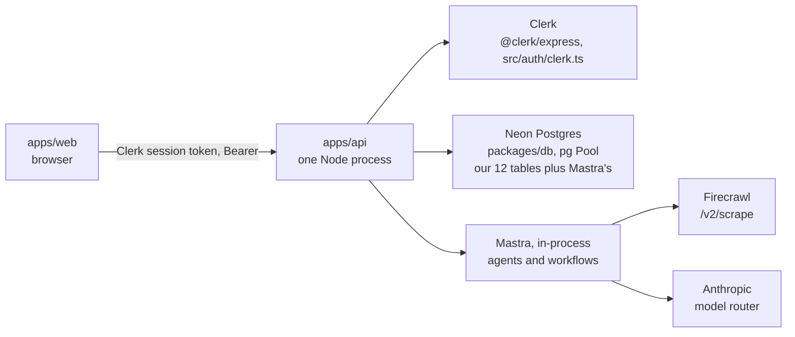
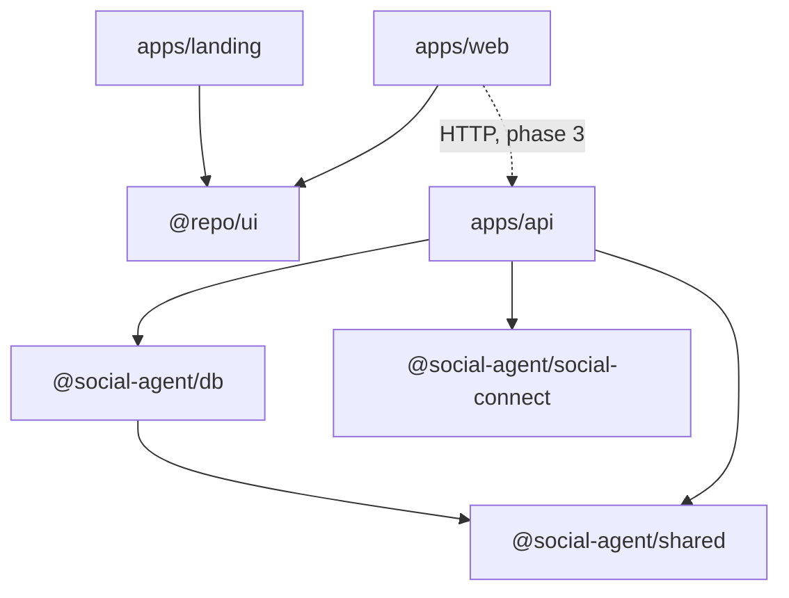
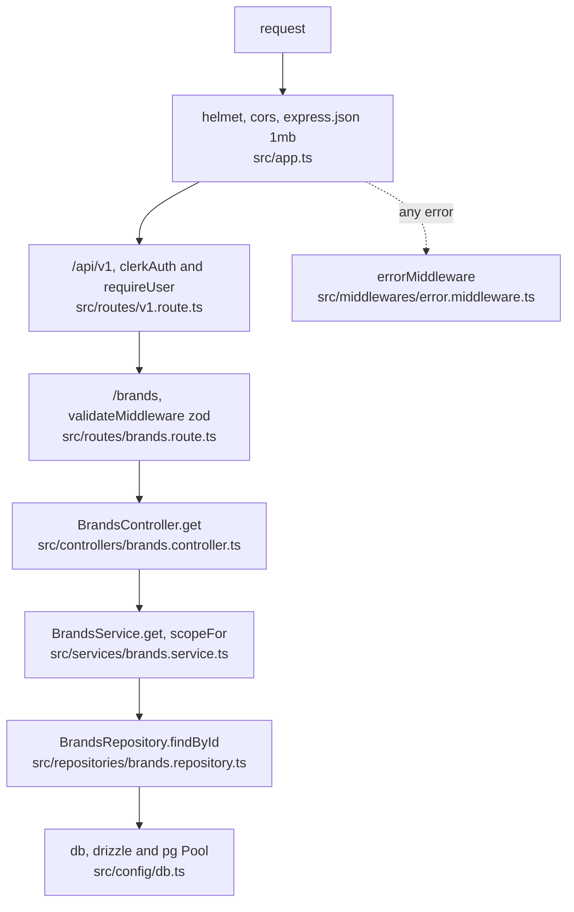
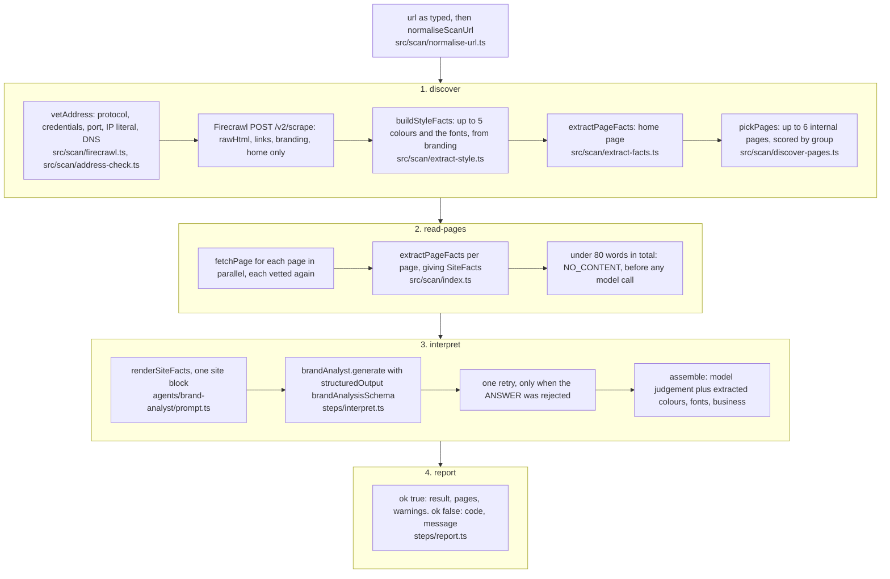
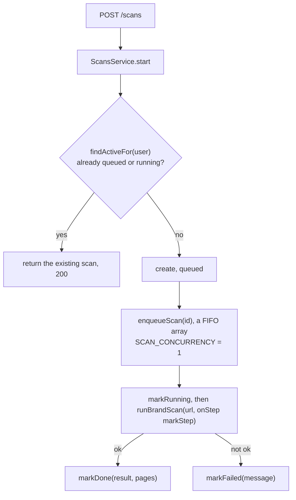
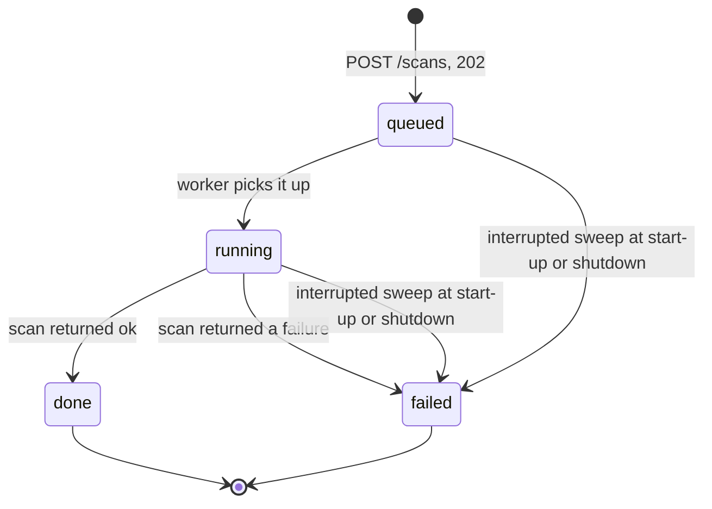
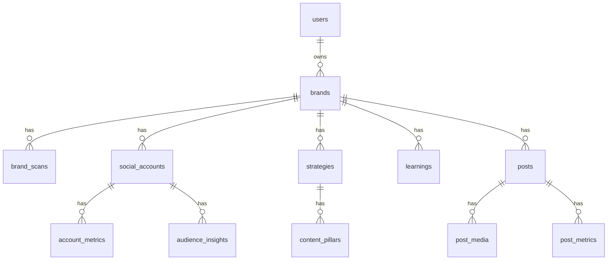

# Architecture


*How the system is put together, for anyone changing the API, the packages or the deployment.*



*The whole runtime: one Node process, three services outside it, one database.*

The system as it is built on 2026-09-22. Working name of the product: **Cadence**, a social
media agent for small businesses. An **admin** (the agency owner) serves **clients** (business
owners); a client owns one or more **brands**, a brand being one website plus the social
accounts managed for it.

Words used throughout: *client* is a person (`users.role = "client"`), *brand* is a website
workspace. Defined in [`AGENTS.md`](../AGENTS.md) and `packages/db/src/schema.ts`.

<a id="contents"></a>

## Contents

- [1. Monorepo map](#1-monorepo-map)
- [2. Runtime topology](#2-runtime-topology)
- [3. The API request path](#3-the-api-request-path)
- [4. Agent architecture](#4-agent-architecture)
- [5. The brand scan pipeline](#5-the-brand-scan-pipeline)
- [6. The scan queue](#6-the-scan-queue)
- [7. Data model](#7-data-model)
- [8. Environment and configuration](#8-environment-and-configuration)
- [9. Build and run](#9-build-and-run)
- [10. Deployment assumptions](#10-deployment-assumptions)
- [11. Known limits and deferred items](#11-known-limits-and-deferred-items)
- [Related](#related)

<a id="1-monorepo-map"></a>

## 1. Monorepo map

pnpm 11 workspaces and Turborepo 2, TypeScript 7, Node 24 or newer (`package.json`,
`turbo.json`).

| Path                    | Package                                          | What it is                                                  |
| ----------------------- | ------------------------------------------------ | ----------------------------------------------------------- |
| **`apps/web`**          | `web`                                            | Next.js 16 product app for clients and admins               |
| **`apps/landing`**      | `landing`                                        | Next.js marketing site, port 3001                           |
| **`apps/api`**          | `api`                                            | Express 5 and Mastra 1.66 API, bundled by tsup              |
| **`packages/ui`**       | `@repo/ui`                                       | Design system: tokens, components, motion, theme            |
| **`packages/db`**       | `@social-agent/db`                               | Drizzle schema, migrations, the Postgres connection factory |
| **`packages/shared`**   | `@social-agent/shared`                           | Zod schemas (`src/schema`) and their inferred types (`src/types`), shared by API, web and db |
| **`packages/social-connect`** | `@social-agent/social-connect`             | Network OAuth providers (Instagram built; Facebook, LinkedIn, TikTok planned): authorize URL, exchange, refresh, profile. No framework or storage |
| **`packages/config/*`** | `@repo/eslint-config`, `@repo/typescript-config` | Lint and TypeScript configs                                 |

`apps/web` renders on the server since 2026-09-22: pages are async server components that read
through `lib/api/server.ts`, client islands write through the Server Actions in
`lib/api/actions.ts`, and the mock behind both (`lib/api/mock/`) runs in the Next.js process.
Route files live in `app/`, each screen's pieces in `features/<area>/`. The seam to the real
API is those two files; it is crossed for onboarding in phase 2B and for the rest in phase 3.



*Who depends on whom; the dotted edge is the seam `apps/web` has not crossed yet.*

- `@social-agent/db` imports types from `@social-agent/shared` for its JSON columns; nothing
  imports back.
- `apps/api` reads both packages from their `dist` folders (`tsc` build), so a package must be
  rebuilt after a change ([`apps/api/AGENTS.md`](../apps/api/AGENTS.md)).
- A dependency used by `packages/ui` must be declared there at the same version the apps use,
  so pnpm links one copy ([`AGENTS.md`](../AGENTS.md)).

<a id="2-runtime-topology"></a>

## 2. Runtime topology

The diagram at the top of this page is the whole of it.

- **One process.** Express and Mastra share it: `src/app.ts` builds the Express app and mounts
  `MastraServer` from `@mastra/express`; `src/server.ts` listens and handles shutdown.
- **Anthropic** is reached through Mastra's model router; ids live in
  `src/mastra/config/models.ts`.
- **Clerk** authenticates; our `users` table owns identity for everything else, so Clerk can be
  replaced without touching ownership data.
- `apps/web` talks to Clerk directly for sign-in (`lib/auth/viewer.ts`, once per request) and,
  from phase 2B (the onboarding screens) and fully in phase 3, to this API. Today
  `lib/api/server.ts` and `lib/api/actions.ts` serve mock data from the Next.js process.

> [!CAUTION]
> The API never connects to a user-typed URL. Firecrawl fetches and renders websites from its
> own network (`src/scan/firecrawl.ts`). See the SSRF boundary in [SECURITY.md](./SECURITY.md).

<a id="3-the-api-request-path"></a>

## 3. The API request path

Four layers, always in this order ([`apps/api/AGENTS.md`](../apps/api/AGENTS.md)). All three
class layers use static methods.

| Layer          | Folder             | Does                                                   | Must not              |
| -------------- | ------------------ | ------------------------------------------------------ | --------------------- |
| **Route**      | `src/routes`       | URL to controller method; validates the body with a zod schema from `packages/shared` | Hold logic |
| **Controller** | `src/controllers`  | Reads the request, calls one service method, sends `{ success, data }` | Hold rules or queries |
| **Service**    | `src/services`     | Business rules, scope, row to response mapping, 404s   | Import Drizzle        |
| **Repository** | `src/repositories` | Every database query                                   | Throw HTTP errors     |



*One request through the four layers, with the one exit every layer shares.*

### The ownership scope rule

`scopeFor(user)` in `src/services/brands.service.ts` returns `"all"` for an admin and
`{ ownerId: user.id }` for everyone else. The repository puts that scope into the `WHERE`
clause of **every** query (`inScope`, `live` and `byId` in
`src/repositories/brands.repository.ts`), so a client can never read, change or archive a brand
that is not theirs. Archived brands are excluded by the same helper. "Missing", "archived" and
"not yours" all answer `404 BRAND_NOT_FOUND`, so ids cannot be probed.

Scans take the scope the same way: `scopeFor` in `src/services/scans.service.ts` feeds
`ScanScope` in `src/repositories/scans.repository.ts`, keyed on `requestedBy`. Any new
brand-scoped data must do the same.

`requireUser` (`src/middlewares/auth.middleware.ts`) resolves the Clerk id into our `users` row
via `UsersService.findOrCreate` and sets `req.user`; controllers read it with
`currentUser(req)`. `requireAdmin` is mounted on the whole `/api/v1/admin` router.

<a id="4-agent-architecture"></a>

## 4. Agent architecture

The team of nine specialists and six workflows is described in
`apps/api/src/mastra/README.md`. Built today: the **Brand Analyst** and the **brand-scan**
workflow. The other eight agents and five workflows are README-only scaffolding.

Rules that shape the code:

- **A workflow, not a tool-calling agent.** A scan is a defined process: code finds pages,
  colours, fonts, phone and email; the model only interprets. One LLM call per scan keeps cost
  and time predictable, and each step id maps onto `brand_scans.current_step`.
- **Code owns every fact.** `brandAnalysisSchema`
  (`src/mastra/agents/brand-analyst/output.schema.ts`) has no field for a phone, email,
  address, hours, colour value or font, so the model cannot write one. `assemble()` in
  `steps/interpret.ts` splices the model's judgement onto the extracted facts.
- **Skills are inlined, not tools.** `loadSkill()` (`src/mastra/config/skills.ts`) reads
  `src/mastra/skills/<name>/SKILL.md`, strips the front matter and puts the body straight into
  the agent's instructions; `skills:` would add tool calls, and this agent must answer in one
  call. The build copies the folder to `dist/skills` (`scripts/copy-skills.mjs`, wired as
  tsup's `onSuccess`).
- **Model ids in one file.** `src/mastra/config/models.ts`: tiers `expert`, `standard` and
  `fast`, plus `AGENT_MODELS` mapping each specialist to a tier. The Brand Analyst runs on
  `standard`.
- **Storage.** `src/mastra/index.ts` registers the agent and workflow and sets a
  `MastraCompositeStore`: `PostgresStore` (the same Neon database, from
  `process.env.DATABASE_URL`) as the default, with the `observability` domain on a local
  `DuckDBStore` (`apps/api/mastra.duckdb`). A `Memory` instance on the Postgres store exists
  for later phases; the Brand Analyst has no memory and no tools.
- **One function per workflow.** The rest of the API calls `runBrandScan`
  (`src/mastra/workflows/brand-scan/run.ts`), never Mastra's HTTP routes. `run.ts` is separate
  from `workflow.ts` because `mastra/index.ts` imports the workflow, and one file would be a
  circular import across a top-level await.
- **Failures are returned, not thrown.** Step outputs are persisted to Postgres, which would
  reduce a thrown `ScanError` to a message, so each step returns `{ failure }` and later steps
  pass it along (`workflows/brand-scan/schemas.ts`).

<a id="5-the-brand-scan-pipeline"></a>

## 5. The brand scan pipeline

`src/scan/*` is plain TypeScript with no Mastra import, so it runs without an LLM or an API key
(`pnpm --filter api run scan -- <url> --facts`).



*The four workflow steps; their ids are what `brand_scans.current_step` reports to a poller.*

Budgets and limits (`src/scan/index.ts`, `src/scan/firecrawl.ts`): `SCAN_BUDGET_MS = 45_000`
covers fetching only; 30 s render timeout per page; 2 MB of HTML kept per page; a page under
200 characters of `rawHtml` is `NOT_A_WEBSITE`; at most 6 inner pages plus the home page.

Error codes, all with owner-facing messages in `SCAN_MESSAGES` (`src/scan/types.ts`):
`INVALID_URL`, `BLOCKED_ADDRESS`, `SITE_UNREACHABLE`, `NOT_A_WEBSITE`, `NO_CONTENT`,
`INTERPRETATION_FAILED`.

Firecrawl behaviour we rely on is recorded in
`.agents/skills/brand-scan-firecrawl/SKILL.md`: keyless in development and
`FIRECRAWL_API_KEY` in production, a free key allowing 10 requests a minute, `fontStacks` real
and `fontFamilies` junk, and the inner `metadata.statusCode` that must be read.

<a id="6-the-scan-queue"></a>

## 6. The scan queue

Designed in
[`2026-09-22-scan-endpoints-design.md`](./superpowers/specs/2026-09-22-scan-endpoints-design.md);
built in `apps/api/src/scan-queue/index.ts`, `src/services/scans.service.ts`,
`src/repositories/scans.repository.ts`, `src/controllers/scans.controller.ts` and
`src/routes/scans.route.ts`, and verified over HTTP on 2026-09-22.



*What one `POST /scans` does, including the second click that gets the first scan back.*



*The status a caller polls; every path ends, so a scan never stays stuck.*

- **In-process FIFO, concurrency 1.** A free Firecrawl key allows 10 requests a minute and a
  scan is up to 7, so one at a time. The queue is a module-level array; a Postgres-backed queue
  replaces it when there is more than one API process.
- **One active scan per user.** A second `POST /scans` while one is queued or running returns
  the existing scan with `200` instead of `202`, so a double click cannot spend Firecrawl
  credits twice.
- **Start-up sweep.** `src/server.ts` calls `ScansRepository.failInterrupted()` after the
  database check: every row still `queued` or `running` becomes `failed` with
  `"The scan was interrupted. Please try again."`. Shutdown runs the same sweep when
  `pendingScanCount() > 0`.
- **Unexpected failures** (a Firecrawl account problem or outage, the model provider, a bug)
  are logged with the scan id and stored as
  `"Something went wrong on our side. Please try again."`; the six `ScanError` messages are
  stored as they are.

> [!WARNING]
> Divergence from the spec worth knowing: the spec names a `startScanWorker()` called from
> `server.ts`; the code has no such export, because the worker loop starts lazily inside
> `enqueueScan`. Nothing else in the design changed.

<a id="7-data-model"></a>

## 7. Data model

Twelve tables, all in `packages/db/src/schema.ts`, designed in
[`2026-09-20-database-schema-design.md`](./superpowers/specs/2026-09-20-database-schema-design.md).
Migrations `0000` to `0003` are in `packages/db/drizzle`. Primary keys are `uuid` with
`defaultRandom()` except the metric tables, which use composite keys. Every timestamp is
`timestamptz`. Nothing with history under it is hard-deleted.



*The twelve tables and how they hang off a brand; Mastra's own tables are not shown.*

<details>
<summary>Column-by-column detail for the twelve tables</summary>

**People and brands.** `users` holds our own record of a person: `clerk_id` (unique, null while
only invited), lowercase unique `email` (a check constraint enforces the lowercase), `role`
(`admin` or `client`), `status` (`invited` or `active`), `invited_by`. `brands` is one website
workspace: `owner_id` and `created_by` (both pointing at `users`), `name`, `url`, `industry`,
`accent`, `stage` (`onboarding`, `strategy`, `content`, `approval`, `publishing`, `learning`),
the `brand` JSON brand kit, `business` JSON (public phone, email, location, hours),
`platforms[]`, `preferences`, and the soft delete: `status` (`active`, `archived`) is what every
query filters on, `archived_at` records when.

**Onboarding and strategy.** `brand_scans` is one row per scan: nullable `brand_id` (the
onboarding scan runs before the brand exists), `requested_by`, `url`, `status` (`queued`,
`running`, `done`, `failed`), `current_step` (the `brand_scan_steps` enum: `discover`,
`read-pages`, `interpret`, `report`), `pages`, `result`, `error`, `started_at` and
`finished_at`. `strategies` is one immutable row per version per brand, `status` (`draft`,
`active`, `superseded`) with a partial unique index allowing one `active` per brand, plus
`goal`, `cadence` (per platform: `perWeek` and `bestTimes` as `{ day, time }`), `audience`,
`change_note`, `approved_by` and `approved_at`. `content_pillars` hangs off a strategy version
with a stable `key`, a `share` of 0 to 100 (check constraint) and a `position`. `learnings` is
the agent's memory, tied to the strategy version that observed it and the one that applied it,
with an `impact` of `up`, `down` or `neutral`.

**Content.** `posts` is one post on one platform: `platform`, `format` (`image`, `carousel`,
`reel`, `story`), `hook`, `caption`, `hashtags[]`, `ai_note`, `art`, `status` (`draft`,
`in_review`, `approved`, `scheduled`, `published`, `rejected`), the schedule and publish
columns, the review columns and `rejection_reason`. Indexed on `(brand_id, status)` and on
`(status, scheduled_for)` so the publisher can find due posts. `post_media` holds the files'
rows; the files themselves live in object storage (provider not decided yet).

**Accounts and analytics.** `social_accounts` is one account per platform per brand (unique on
`(brand_id, platform)` and on `(platform, external_account_id)`), with AES-256-GCM token
columns that are never selected into a client response, `scopes[]`, `meta`, and a `status` of
`connected`, `expired` or `disconnected`. Instagram connects through Meta's Instagram Login
(`createInstagramProvider` in `packages/social-connect`, bound to the app keys by
`src/social/providers.ts`); the flow is in `docs/API_SPEC.md` §5.1. `post_metrics` (primary key `(post_id, captured_at)`)
snapshots a post over time; `account_metrics` (primary key `(social_account_id, date)`) is one
row per account per day; `audience_insights` (primary key `(social_account_id, captured_on)`)
stores each network's `active_hours` and `demographics` as JSON.

</details>

Mastra adds its own tables to the same database through `PostgresStore`; we do not model chat.

> [!NOTE]
> Tables 1 to 3 exist and are used. Phases 2 to 5 fill the rest. `brand_research`,
> `brands.intake` and the two `strategies` research columns are designed but **not** in the
> schema or a migration yet (schema spec §13).

<a id="8-environment-and-configuration"></a>

## 8. Environment and configuration

`apps/api/src/config/env.ts` parses `process.env` with zod at start-up and exits with a message
naming every missing or invalid variable. Validated there:

| Variable                                        | Rule                                                         |
| ----------------------------------------------- | ------------------------------------------------------------ |
| **`NODE_ENV`**                                  | `development`, `production` or `test`, default `development` |
| **`DATABASE_URL`**                              | must start `postgres://` or `postgresql://` (Neon)           |
| **`CLERK_SECRET_KEY`, `CLERK_PUBLISHABLE_KEY`** | non-empty                                                    |
| **`ADMIN_EMAILS`**                              | comma-separated list, default empty                          |
| **`PORT`**                                      | positive integer, default `4000`                             |
| **`CORS_ORIGINS`**                              | comma-separated list, default `http://localhost:3000`        |
| **`FRONTEND_URL`**                              | URL, default `http://localhost:3000`; where OAuth callbacks send the browser |
| **`SOCIAL_TOKEN_KEY`**                          | optional, 64 hex characters; token encryption and `state` signing (`src/social/crypto.ts`) |
| **`INSTAGRAM_APP_ID`, `INSTAGRAM_APP_SECRET`**  | optional; without them `connect` answers `501`               |
| **`INSTAGRAM_REDIRECT_URI`**                    | optional, default `http://localhost:<PORT>/api/v1/oauth/instagram/callback`; must match the Meta app |

Read directly from the environment, **not** through `env.ts`: `FIRECRAWL_API_KEY`
(`src/scan/firecrawl.ts`; absent means keyless, which is fine in development and must be set in
production), `ANTHROPIC_API_KEY` (the Mastra model router; `scripts/scan.ts` checks for it),
`DATABASE_URL` again in `src/mastra/index.ts`, and the optional
`MASTRA_PLATFORM_ACCESS_TOKEN`. Values live in `apps/api/.env`, which is never committed. No
value appears in this repo's documentation.

`src/config/db.ts` exports the one connection (`db`, `pool`) built by
`createDb(env.DATABASE_URL)`; only repositories import it.

<a id="9-build-and-run"></a>

## 9. Build and run

```bash
pnpm install                              # pnpm 11; answer allowBuilds in pnpm-workspace.yaml
pnpm --filter api run dev                 # tsx watch src/server.ts
pnpm --filter web run dev                 # port 3000
pnpm --filter landing run dev             # port 3001
pnpm --filter api run build               # tsup -> dist/server.js, then copy-skills
pnpm --filter api run start               # node dist/server.js
pnpm --filter api run check-types
pnpm --filter api run scan -- <url>       # the scan from the terminal (--facts skips the LLM)
pnpm --filter api run dev-token -- <email>   # print a Clerk token for trying endpoints
pnpm --filter @social-agent/db run db:generate | build | db:migrate
```

Turborepo wires `build` to `^build` and `dev` to `^build`, so `packages/shared` and
`packages/db` are compiled first.

> [!IMPORTANT]
> There is **no automated test suite**, by the owner's decision; verification is real runs with
> recorded output.

> [!TIP]
> Known tooling traps, recorded in the session memory: an unanswered `allowBuilds` entry makes
> every `pnpm run` fail with `ERR_PNPM_IGNORED_BUILDS`; Neon's first connection after idle can
> fail once, which is why `checkDatabase()` in `src/server.ts` retries once; Smart App Control
> can transiently block `turbo.exe` on this Windows machine.

<a id="10-deployment-assumptions"></a>

## 10. Deployment assumptions

Today: **one always-on Node process** for the API.

- The scan queue lives in that process's memory. Two processes would run two scans at once and
  blow the Firecrawl rate limit, and the start-up sweep of one process would fail the other's
  running scans. More than one process means moving the queue to Postgres first.
- The tsup bundle does not run migrations: a deploy step must run
  `pnpm --filter @social-agent/db exec tsx src/cli-migrate.ts` with `DATABASE_URL` set, before
  the API starts.
- `src/mastra/skills` must sit next to `dist` as `dist/skills`; the build's `onSuccess` hook
  does this, and `loadSkill` throws if the folder is missing.
- `SIGINT` and `SIGTERM` stop new requests, let running ones finish, fail any pending scans and
  close the pool, with a 10 s forced-exit timer (`src/server.ts`).
- Background jobs (publisher, metric syncs, token refresh, strategy auto-activation) assume the
  same always-on process. Sleeping or serverless hosting would need `POST /internal/jobs/:job`,
  which is catalogue open question 6 and not decided yet.

> [!CAUTION]
> `MastraServer` (Studio's routes, no auth) is mounted only when `NODE_ENV !== "production"`
> (`src/app.ts`). The host **must** set `NODE_ENV=production`.

<a id="11-known-limits-and-deferred-items"></a>

## 11. Known limits and deferred items

One of the ten is closed. Progress is the share of the item's own scope that is finished, so a
limit nobody has started sits at zero.

| Item                                                       | Status           | Progress       | Where, and the note                                                                    |
| ---------------------------------------------------------- | ---------------- | -------------- | -------------------------------------------------------------------------------------- |
| **Scan endpoints and the queue**                           | ![done][done]    | ![100%][pr100] | `src/scan-queue`, `src/{routes,controllers,services,repositories}/scans.*`. Not committed yet |
| **`GET /health/test-error`**                               | ![open][open]    | ![0%][pr0]     | `src/routes/health.route.ts`. Developer tool; remove before production                 |
| **`/admin/clients` has no pagination**                     | ![deferred][def] | ![0%][pr0]     | `src/repositories/users.repository.ts`. The list returns everything                    |
| **Invite redirect uses `CORS_ORIGINS[0]`**                 | ![open][open]    | ![0%][pr0]     | `src/services/admin-clients.service.ts`. A `WEB_APP_URL` variable is wanted            |
| **Admin role changes lag up to 1 hour**                    | ![deferred][def] | ![0%][pr0]     | `ONE_HOUR_MS` in `src/services/users.service.ts`. The Clerk profile is trusted an hour |
| **Mastra observability on local DuckDB**                   | ![deferred][def] | ![0%][pr0]     | `src/mastra/index.ts`. `apps/api/mastra.duckdb` is a local file, not shared            |
| **No rate limiting beyond one-active-scan**                | ![deferred][def] | ![0%][pr0]     | Nothing else throttles a caller                                                        |
| **`brand_research`, `brands.intake`**                      | ![planned][plan] | ![0%][pr0]     | Schema spec §13. Designed, no migration yet                                            |
| **Strategy, posts, chat, accounts, publishing, analytics** | ![planned][plan] | ![0%][pr0]     | Catalogue phases 2 to 5. Not started                                                   |
| **Billing**                                                | ![later][later]  | ![0%][pr0]     | Schema spec, "Left out on purpose". Provider-agnostic, not Clerk Billing               |

<a id="related"></a>

## Related

- [PRD.md](./PRD.md) sets out what the product must do.
- [API_SPEC.md](./API_SPEC.md) is the HTTP contract.
- [SECURITY.md](./SECURITY.md) holds the threat model and the controls.
- [DESIGN.md](./DESIGN.md) is the design system.
- [TASKS.md](./TASKS.md) is the board.
- [LESSION.md](./LESSION.md) collects the lessons learned.
- [MEMORY.md](./MEMORY.md) is the brief to load first every session.

<!-- Status and progress badges. Progress renders as an uptime-style bar: green for the done share, grey for the rest. -->

[done]: https://img.shields.io/badge/done-brightgreen
[open]: https://img.shields.io/badge/open-blue
[def]: https://img.shields.io/badge/deferred-lightgrey
[plan]: https://img.shields.io/badge/planned-lightgrey
[later]: https://img.shields.io/badge/later-lightgrey
[pr0]: https://img.shields.io/badge/%20-%7C%7C%7C%7C%7C%7C%7C%7C%7C%7C%200%25-lightgrey?style=flat-square&labelColor=lightgrey
[pr100]: https://img.shields.io/badge/%7C%7C%7C%7C%7C%7C%7C%7C%7C%7C-100%25-brightgreen?style=flat-square&labelColor=brightgreen
