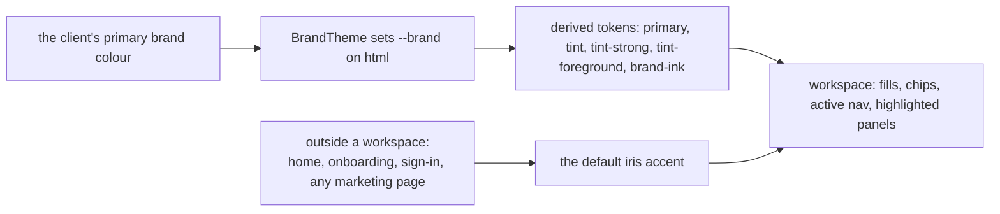
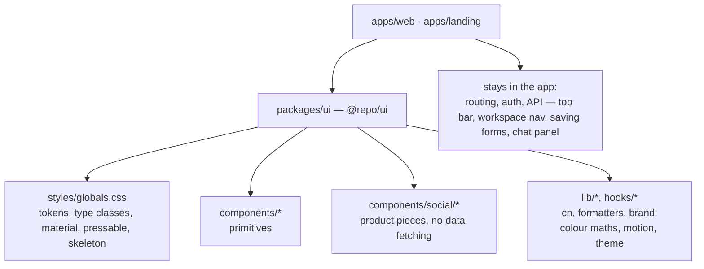

# Design system


*The rules behind every screen, for anyone building or changing UI in the product,
the marketing site or the shared package.*

These rules cover `apps/web` and any other app built on `packages/ui`, marketing pages
included, so new work matches what already exists without anyone having to ask.

> [!IMPORTANT]
> If something isn't covered here, find the closest existing screen, copy its pattern,
> and prefer the quieter option. Don't introduce a new colour, typeface, radius, shadow
> or animation style. Where a rule here conflicts with the code,
> `packages/ui/src/styles/globals.css` and `packages/ui/src/lib/motion.ts` are the source
> of truth; fix this file.

> [!NOTE]
> The product name and logo are undecided. Use the `APP_NAME` constant from
> `lib/utils.ts` and the `Logo` component from `components/shell/top-bar.tsx`.
> Never hardcode the name.

<a id="contents"></a>

## Contents

- [1. What this product is](#1-what-this-product-is)
- [2. The one big idea](#2-the-one-big-idea)
- [3. Colour](#3-colour)
- [4. Typography](#4-typography)
- [5. Layout](#5-layout)
- [6. Shape, depth and material](#6-shape-depth-and-material)
- [7. Components](#7-components)
- [8. Motion](#8-motion)
- [9. Interaction rules](#9-interaction-rules)
- [10. Writing](#10-writing)
- [11. Themes](#11-themes)
- [12. Building a landing page (or any marketing page)](#12-building-a-landing-page)
- [13. Never do these](#13-never-do-these)
- [14. Where things live](#14-where-things-live)
- [15. Code conventions and the definition of done](#15-code-conventions)
- [Related](#related)

<a id="1-what-this-product-is"></a>

## 1. What this product is

An AI agent that runs a business's social media. The user pastes a website URL; the agent
reads it, builds a brand kit, plans a strategy, drafts posts, waits for a human to approve
them, publishes, measures, and rewrites the strategy from the results.

Two kinds of people use it:

- **Clients** (business owners). They sign in and see only their own brand. Often not
  technical, often on a phone.
- **Admins** (the agency). They see every client and switch between them.

> **The feeling to design for is calm and in control.** An AI is posting publicly on
> someone's behalf. Every screen should make it obvious what the agent did, why, and that
> nothing goes out without approval. Never clever, never busy, never alarming.

<a id="2-the-one-big-idea"></a>

## 2. The one big idea

**The chrome is quiet. The client's brand supplies the colour.**

The interface itself is neutral: cool grey paper, dark ink, white cards. When a workspace
is open, the accent colour becomes that client's own primary brand colour (`BrandTheme`
sets `--brand` on `<html>`). A pottery studio's workspace is terracotta; a dentist's is
blue.



Why: the product is about brand identity, so the brand is the decoration. It also tells an
admin at a glance which client they're in.

Outside a workspace — home, onboarding, sign-in, **and any marketing page** — the accent
is the default iris ![iris][iris].

Everything else in this document exists to keep the chrome quiet enough for that to work.

<a id="3-colour"></a>

## 3. Colour

> [!CAUTION]
> Never write a hex value or a Tailwind palette colour (`bg-blue-500`, `text-gray-600`) in
> a component. Use the semantic tokens. They switch for dark mode and for each client
> automatically.

### Surfaces and ink

One ramp from paper to ink, in both themes. Nothing here carries meaning; it is the quiet
chrome that lets the brand colour show.

| Light      | Dark                  | Token                            | Used for                              |
| ---------- | --------------------- | -------------------------------- | ------------------------------------- |
| ![l][l-bg] | ![d][d-bg]            | `background`                     | The page                              |
| ![l][l-cd] | ![d][d-cd]            | `card`                           | Panels, rows, inputs                  |
| ![l][l-pp] | ![d][d-pp]            | `popover`                        | Menus, tooltips                       |
| ![l][l-sc] | ![d][d-mu] ![d][d-ac] | `secondary` / `muted` / `accent` | Quiet fills, hover, segmented tracks  |
| ![l][l-in] | ![d][d-in]            | `input`                          | Input borders, switch track           |
| ![l][l-bd] | ![d][d-bd]            | `border`                         | Hairlines, table rules                |
| ![l][l-mf] | ![d][d-mf]            | `muted-foreground`               | Secondary text, labels, icons         |
| ![l][l-fg] | ![d][d-fg]            | `foreground`                     | Body text, headings                   |

### Status

| Light      | Dark       | Token         | Used for                        |
| ---------- | ---------- | ------------- | ------------------------------- |
| ![l][l-su] | ![d][d-su] | `success`     | Approved, connected, up         |
| ![l][l-wa] | ![d][d-wa] | `warning`     | Needs approval, needs attention |
| ![l][l-de] | ![d][d-de] | `destructive` | Reject, delete, down, errors    |

**Status colours never change with the client.** Approve is always green, reject always
red, waiting always amber. Don't use the brand colour to mean a status.

### The brand

These have no fixed value. They are derived from the open workspace's brand colour, and
fall back to iris ![iris][iris] when no workspace is open.

| Token                            | Light                                            | Dark      | Used for                              |
| -------------------------------- | ------------------------------------------------ | --------- | ------------------------------------- |
| `primary` / `primary-foreground` | the brand colour / ink or white, whichever reads | same      | Main action fills                     |
| `tint` / `tint-strong`           | brand at 10% / 18% over card                     | 16% / 28% | Highlighted panels, active nav, chips |
| `tint-foreground`, `brand-ink`   | brand, contrast-corrected                        | same      | Brand-coloured **text and icons**     |

### Rules

- **Brand colour as a fill:** `bg-primary text-primary-foreground`. **Brand colour as text
  or an icon:** `text-tint-foreground` or `text-brand-ink`, never `text-primary`. A
  client's brand can be pale yellow; the ink tokens are contrast-checked (`legibleOn` in
  `packages/ui/src/lib/utils.ts`), raw `primary` is not.
- One accent per view. Colour means something (brand, status) or it isn't there. No
  decorative gradients, no gradient text, no coloured section backgrounds.
- To tint a subtree to a specific client (a row in a list of clients), add
  `className="brand-scope"` and `style={brandStyle(client.accent)}`. Setting `--brand`
  alone won't re-derive the tints.
- Soft status fills use opacity on the status token: `bg-success/12 text-success`,
  `bg-warning/14 text-warning`, `bg-destructive/12 text-destructive`.

<details>
<summary>Token values for code</summary>

| Token                            | Light     | Dark                  |
| -------------------------------- | --------- | --------------------- |
| `background`                     | `#F5F6F8` | `#0F1116`             |
| `card`                           | `#FFFFFF` | `#171A21`             |
| `popover`                        | `#FFFFFF` | `#1B1F28`             |
| `secondary` / `muted` / `accent` | `#ECEEF2` | `#1F232C` / `#232833` |
| `input`                          | `#D5D9E1` | `#343A47`             |
| `border`                         | `#E1E4EA` | `#272C37`             |
| `muted-foreground`               | `#5F6879` | `#9AA3B2`             |
| `foreground`                     | `#1A1D26` | `#ECEEF2`             |
| `success`                        | `#178A5E` | `#4CC596`             |
| `warning`                        | `#B7740A` | `#E5A53D`             |
| `destructive`                    | `#CF3F57` | `#EC6B80`             |
| default iris accent              | `#4B3FE4` | `#4B3FE4`             |

</details>

<a id="4-typography"></a>

## 4. Typography

Two families, loaded in `app/layout.tsx`. **Bricolage Grotesque** (`font-display`) takes
headings, big numbers and the headline on post artwork; it has an optical-size axis, so it
tightens as it grows. **Instrument Sans** (`font-sans`, the default) takes everything else.

How the two read together:

> ### Start with your website
>
> Paste a link. The agent reads the site, builds a brand kit and plans the week — and
> nothing goes out until you approve it.
>
> Bricolage Grotesque above, tight and semibold. Instrument Sans here, 1.55 leading,
> lines kept under 65 characters.

Use the type classes, not ad-hoc sizes: `type-display` for one hero per page at most,
`type-title` for a page `<h1>`, `type-heading` for a panel or section `<h2>`, the default
body size for paragraphs and table cells, `type-label` for captions and metadata, and
`type-number` for metrics.

<details>
<summary>Type class values</summary>

| Class              | Size                                       | Line height | Tracking | Use                                           |
| ------------------ | ------------------------------------------ | ----------- | -------- | --------------------------------------------- |
| **`type-display`** | `clamp(2.25rem, 1.4rem + 3.6vw, 4.25rem)`  | 1.02        | −0.035em | One per page at most: home hero, landing hero |
| **`type-title`**   | `clamp(1.625rem, 1.3rem + 1.2vw, 2.25rem)` | 1.1         | −0.025em | Page title (`<h1>`)                           |
| **`type-heading`** | 1.1875rem                                  | 1.25        | −0.015em | Panel and section headings (`<h2>`)           |
| **body (default)** | 0.9375rem                                  | 1.55        | 0        | Paragraphs, table cells                       |
| **`type-label`**   | 0.8125rem, muted                           | 1.35        | +0.005em | Captions, metadata, help text                 |
| **`type-number`**  | set size separately                        | —           | −0.03em  | Metrics. Display face, tabular figures        |

</details>

### Rules

- **Sentence case everywhere.** No ALL CAPS, no Title Case For Headings, no letter-spaced
  eyebrow labels above headings.
- Tracking follows size: the bigger the text, the tighter. Never one `letter-spacing` for
  everything.
- Hierarchy comes from size, weight and colour together. Weights in use: 400 body, 500
  (`font-medium`) for emphasis and labels that matter, 600 (`font-semibold`) for display
  type.
- Don't emphasise a single word in a headline with colour, italics or a gradient.
- Any number that changes or sits in a column gets `tabular-nums`. **No monospace font
  anywhere**, including for data.
- Body text lines stay under ~65 characters: use `max-w-[52ch]` to `max-w-[62ch]`.
- Headings use `text-wrap: balance` (already global for `h1`–`h3`).

<a id="5-layout"></a>

## 5. Layout

- **Left-aligned by default.** Centre only self-contained moments: auth screens, the
  approval card stack, empty states, the scan progress.
- **Widths:** `max-w-5xl` for single-column pages (home, onboarding, marketing);
  `max-w-[88rem]` for the app shell; `max-w-md` / `max-w-xl` for forms and focused tasks.
- **Gutters:** `px-4`, `md:px-6`.
- **Breakpoints:** phone-first. `md` (768px) is where tables, the month grid and
  two-column layouts appear. `lg` (1024px) is where the workspace rail appears. Nothing
  may scroll horizontally at 390px.
- **Inside a grid or flex row, give shrinking children `min-w-0`** (and grids of text
  `grid-cols-[minmax(0,1fr)]`) or long text will push the layout wide.
- Proximity is grouping: a control sits next to what it changes. Don't box things just to
  separate them; use space first.
- A page answers, in order: where am I (title), what should I do now (one primary action),
  then the detail.

Vertical rhythm, smallest step to largest:

| Step             | Scale    | Where                 |
| ---------------- | -------- | --------------------- |
| `gap-5`          | ▪▪       | Between panels        |
| `p-5 md:p-6`     | ▪▪       | Inside a panel        |
| `mb-7`           | ▪▪▪      | Under a page header   |
| `mt-16 md:mt-24` | ▪▪▪▪▪▪▪▪ | Big page-level breaks |

### App shell

- **Top bar:** floating, translucent pill (`material`), sticky, `h-14`. Logo, client
  switcher, then actions on the right.
- **Workspace nav:** one component, two postures. At `lg+` a floating rail on the left
  (`w-52`, content gets `lg:pl-64`). Below that, a bottom tab bar (content gets `pb-32`).
  Items follow the agent loop: Overview, Strategy, Content, Approvals, Calendar,
  Analytics. Settings sits apart at the bottom of the rail, and in the top bar on phones.
  **The tab bar is full at six; don't add a seventh.**
- Nav labels name what's inside ("Approvals", "Calendar"), never "Home" or "Dashboard".

<a id="6-shape-depth-and-material"></a>

## 6. Shape, depth and material

Radius follows hierarchy. Don't put one radius on everything.

| Radius        | Scale | On                                          |
| ------------- | ----- | ------------------------------------------- |
| `rounded-sm`  | ▪     | Controls and chips, the tighter option      |
| `rounded-md`  | ▪▪    | Controls and chips                          |
| `rounded-xl`  | ▪▪▪   | Cards and panels                            |
| `rounded-2xl` | ▪▪▪▪  | Sheets and the approval card                |
| full pill     | ▪▪▪▪▪ | Buttons, badges, search, segmented controls |

<details>
<summary>Radius values</summary>

`rounded-md` is 0.75rem, `rounded-xl` is 1.375rem, `rounded-2xl` is 1.75rem.

</details>

- **Two shadows only:** `shadow-raised` for cards resting on the page, `shadow-floating`
  for things above it (top bar, nav, sheets, menus, a card being dragged). No other
  shadows.
- Cards are `bg-card` + `shadow-raised` **with no border**. Borders are for inputs, table
  rules and outline buttons. Don't combine a border and a shadow on the same surface.
- **`material`** (translucent + blur + bright top edge) is only for chrome that floats
  over scrolling content: top bar, nav, menus. Never stack one translucent surface on
  another, and never use it for content cards.
- A highlighted panel is `bg-tint` with no shadow (see the "next step" banner on the
  overview).

<a id="7-components"></a>

## 7. Components

Reuse these before writing anything new. They live in the shared package and are imported
as `@repo/ui/components/<name>` (primitives) or `@repo/ui/components/social/<name>`
(product pieces). They are shadcn-style primitives written for these tokens; restyle
anything new to match.

<details>
<summary>The component reference, need by need</summary>

| Need                                           | Use                                                                                                                                                                                                                                                                                                                                                                                                                                                     |
| ---------------------------------------------- | ------------------------------------------------------------------------------------------------------------------------------------------------------------------------------------------------------------------------------------------------------------------------------------------------------------------------------------------------------------------------------------------------------------------------------------------------------- |
| **Action**                                     | `Button`: `default` (one per view), `secondary`, `outline`, `ghost`, `tint`, `destructive`; sizes `sm` `default` `lg` `icon` `icon-sm`. Always a pill                                                                                                                                                                                                                                                                                                   |
| **Text entry**                                 | `Input`, `Textarea` (`h-11`, `rounded-md`), wrapped in `Form`/`FormField`/`FormItem`/`FormLabel`/`FormMessage`                                                                                                                                                                                                                                                                                                                                          |
| **On/off**                                     | `Switch`                                                                                                                                                                                                                                                                                                                                                                                                                                                |
| **Pick one of a few, or tabs**                 | `Segmented` (the pill slides)                                                                                                                                                                                                                                                                                                                                                                                                                           |
| **Status**                                     | `Badge` (`neutral` `tint` `success` `warning` `danger` `outline`), `StatusBadge` for post status                                                                                                                                                                                                                                                                                                                                                        |
| **Secondary task, editor, confirmation, chat** | `Sheet`: bottom sheet on phones, right-hand panel from `md`. Dismiss by dragging its handle or header; its content keeps all pointer events, so draggable controls work inside it                                                                                                                                                                                                                                                                       |
| **Menu**                                       | `DropdownMenu` (grows from its trigger)                                                                                                                                                                                                                                                                                                                                                                                                                 |
| **Date, time**                                 | `DatePicker` (our month grid) and `TimePicker` (an analog dial from the `timepicker-ui` library, rendered inline inside our `Popover` and themed through the `--tp-*` variables under `.tp-host` in `styles/globals.css`; 5-minute detents, best-time `suggestions` chips, a haptic tick per detent where supported, and a tick sound that is off unless the person turns it on). Never a native date or time input, and never a second time-picker library |
| **Anything that pops out of a field**          | `Popover` (solid surface, because it opens over form text)                                                                                                                                                                                                                                                                                                                                                                                              |
| **A list of short values**                     | `TagInput`                                                                                                                                                                                                                                                                                                                                                                                                                                              |
| **Something at full size**                     | `Lightbox`                                                                                                                                                                                                                                                                                                                                                                                                                                              |
| **Page frame**                                 | `PageHeader`, `Panel` from `@repo/ui/components/states`                                                                                                                                                                                                                                                                                                                                                                                                 |
| **Loading / nothing / failed**                 | `SkeletonRows` or `.skeleton`, `EmptyState`, `ErrorState`                                                                                                                                                                                                                                                                                                                                                                                               |
| **A post's picture**                           | `PostArt` (generated from the brand colours until real media exists)                                                                                                                                                                                                                                                                                                                                                                                    |
| **A network**                                  | `PlatformIcon`, `PLATFORM_LABEL`. Lucide has no brand icons; ours are in `@repo/ui/components/social/platform`                                                                                                                                                                                                                                                                                                                                          |
| **A client's mark**                            | `ClientAvatar`                                                                                                                                                                                                                                                                                                                                                                                                                                          |
| **Where the agent is**                         | `LoopTrack` (full), `LoopTicks` (compact)                                                                                                                                                                                                                                                                                                                                                                                                               |
| **Charts**                                     | `TrendChart`, `RankedBars` in `@repo/ui/components/social/charts` (TanStack Charts)                                                                                                                                                                                                                                                                                                                                                                     |
| **Icons**                                      | `lucide-react`, stroke 1.8–2.2, `size-4` in buttons, `size-5` in nav                                                                                                                                                                                                                                                                                                                                                                                    |

</details>

Forms are always `react-hook-form` + `zod`, validated inline with a message that says how
to fix it. Tables are TanStack Table v9 and become a card list below `md`.

<a id="8-motion"></a>

## 8. Motion

Motion is `motion/react` with the presets in `@repo/ui/lib/motion`. **Springs, not
durations**, because a spring starts from wherever the element is and carries velocity, so
anything can be interrupted or reversed mid-flight.

| Preset                | Bounce / duration | Use                                                         |
| --------------------- | ----------------- | ----------------------------------------------------------- |
| **`spring.smooth`**   | 0 / 0.4           | Default: reveals, layout shifts, step changes               |
| **`spring.snappy`**   | 0 / 0.28          | Small state changes: nav pill, segmented pill, chat bubbles |
| **`spring.sheet`**    | 0.12 / 0.34       | Sheets and drawers                                          |
| **`spring.momentum`** | 0.2 / 0.4         | **Only** after a drag or flick                              |

### Rules

- **No bounce unless a gesture caused the motion.** Overshoot on something that just
  faded in feels wrong.
- **Feedback lands on pointer-down**, not release: add `pressable` (scales to 0.97 on
  `:active`). `Button` already has it.
- **Things leave the way they came.** A sheet that rose from the bottom dismisses
  downward; the next month enters from the right and the previous one returns from the
  left.
- **Menus and popovers grow from their trigger** (`transform-origin` at the trigger).
- **Drags track 1:1**, decide from where the flick is *heading* (`project()` in
  `@repo/ui/lib/motion`), hand the release velocity to the spring, and rubber-band at
  limits. The reference implementation is
  `packages/ui/src/components/social/swipe-card.tsx`.
- Animate only `transform` and `opacity` (and `filter` for a materialise). To animate a
  bar's length, slide it inside an `overflow-hidden` track rather than animating `width`.
- Use `layoutId` for a selection indicator that moves between options.
- CSS transitions are fine for hover, colour and simple opacity. Anything a user can grab
  uses a spring.
- **Motion answers an action.** No scroll-triggered fade-ins on every section, no hover
  lift on every card, no looping decoration, no parallax. One orchestrated moment per page
  at most.
- `MotionConfig reducedMotion="user"` is global, so springs become cross-fades
  automatically. Also honoured in CSS: `prefers-reduced-motion`,
  `prefers-reduced-transparency` (material goes solid), `prefers-contrast: more`.
- Don't start a React Query **mutation** from a mount effect to kick off an
  animation-driven flow (StrictMode breaks it). Model it as a `useQuery` with `enabled`.

<a id="9-interaction-rules"></a>

## 9. Interaction rules

- **Optimistic by default.** The UI changes the moment the user acts and rolls back on
  failure (`useUpdatePost`).
- **Undo instead of "are you sure?".** Reversible actions get a toast with Undo. A
  confirmation appears only for the one irreversible action (deleting a brand).
- **A save button is disabled until something changed**, and its label says what it does:
  "Save changes", "Connect", "Approve". Never "Submit" or "OK".
- **The same word through a whole flow:** the button says "Approve", the toast says
  "Approved", the badge says "Approved".
- **Show the agent's reasoning.** Anything the AI produced carries a short "why" (`aiNote`
  on a post, evidence on a learning).
- **Waiting shows progress with names**, not a spinner alone (see `ScanProgress`).
  Spinners only inside the button that was pressed.
- **Every screen has four states:** loading (skeletons shaped like the content), empty
  (says what will appear and offers the action that fills it), error (says what went wrong
  and offers Try again), and loaded.
- State that another screen may link to lives in the URL (`?tab=accounts`).
- Keyboard: everything reachable, visible focus ring (global `:focus-visible`), arrow keys
  where there's a direction.
- Toasts (`sonner`) are one short line at the bottom centre.

<a id="10-writing"></a>

## 10. Writing

- Plain words, sentence case, active voice, no exclamation marks, no jargon. A user
  "connects Instagram", not "configures an OAuth integration".
- Say what a thing does rather than selling it.
- Errors: what happened, then how to fix it. Never apologise, never be vague. "That
  doesn't look like a website. Try something like acme.com."
- Empty states are an invitation: "Nothing is scheduled. Approved posts land here with
  their publish time."
- Numbers: compact (`18.4K`), deltas signed and coloured (`+6.2%`), dates as `Tue 22 Sep`
  or `22 Sep, 12:00 PM`.
- Admin-facing copy says "client"; client-facing copy says "brand" or "your". Use
  `useViewer().isAdmin` to choose.
- Avoid: middle-dot separators between facts, "WORD — phrase" labels, arrows appended to
  link text, emoji in UI.

<a id="11-themes"></a>

## 11. Themes

- Theme is `data-theme="light|dark"` on `<html>`, chosen from Light / Dark / Match device
  (`@repo/ui/components/theme-menu`), stored in `localStorage.theme`, and applied before
  first paint by `THEME_SCRIPT` (`@repo/ui/lib/theme`).
- Every new surface must be checked in both themes and with at least two different client
  colours, one light (a yellow) and one dark (a navy).

> [!CAUTION]
> Never use `prefers-color-scheme` media queries. Dark values go in
> `:root[data-theme="dark"]`; in markup use the `dark:` variant.

<a id="12-building-a-landing-page"></a>

## 12. Building a landing page (or any marketing page)

The landing page is the same product seen from outside. It uses **the same tokens, type
classes, components, springs and voice**. Do not give it a separate "marketing" look.

### Setup

- Everything except `/sign-in` and `/sign-up` is protected in `proxy.ts`. A public page
  must be added to `isPublicRoute` there. `/` is currently the signed-in home, so either
  serve the landing page at `/` for signed-out visitors or put it on its own route.
- No workspace is open, so the accent is the default iris. Don't invent a marketing
  colour.
- Use the floating `material` top bar pattern: `Logo` on the left; on the right "Sign in"
  (`ghost`) and "Get started" (`default`). `ThemeMenu` belongs there too.
- Width `max-w-5xl`, gutters `px-4 md:px-6`, sections separated by `mt-24 md:mt-32`.

### The hero

**The hero is the product, not a picture of it.** The most characteristic thing this
product does is turn a URL into a brand. So the hero is a left-aligned `type-display`
headline, one supporting sentence in `text-muted-foreground`, and **the real `UrlForm`**.
Submitting sends the visitor to sign up with the URL carried along. No stock illustration,
no big-number-with-gradient, no floating dashboard screenshot at an angle.

```
┌──────────────────────────────────────────────────────────┐
│  (•) Name                          Sign in  [Get started] │  floating material bar
└──────────────────────────────────────────────────────────┘

  Start with your website.                 type-display, left
  One sentence on what happens next.       muted, max-w-[52ch]
  ┌──────────────────────────────┐
  │ (globe) yourbusiness.com [Read]│          the real UrlForm
  └──────────────────────────────┘

  ───────────────────────────────────────────────────────────
  It becomes your brand          ← the ONE orchestrated moment:
  [ post ][ post ][ post ]         the same PostArt cards re-tinting
                                   through 3–4 example brands
  ───────────────────────────────────────────────────────────
  How it works: the loop           genuinely a sequence, so numbering
  1 Read  2 Plan  3 Draft          or LoopTrack is justified here
  4 You approve  5 Publish  6 Learn
  ───────────────────────────────────────────────────────────
  Nothing goes out without you     the approval stack, real and swipeable
  ───────────────────────────────────────────────────────────
  Closing: the URL field again     same component, not a new CTA style
  Footer: quiet, type-label links
```

### Section guidance

- **Show real components with example data** instead of screenshots: `PostArt`, the
  `SwipeCard` stack, `LoopTrack`, `TrendChart`. They're responsive, themed and already
  built. Wrap a demo in `brand-scope` + `brandStyle(hex)` to show it in an example brand's
  colour.
- **Spend the boldness in one place:** the brand re-tint demonstration. It is the
  product's signature and the only place a marketing page should animate on its own.
  Everything around it stays still and quiet.
- Sections are left-aligned text with a component beside or below it. **Do not chop the
  page into a grid of identical icon-title-blurb cards.** If three points need making,
  write them as three short paragraphs or a plain list.
- Numbered steps only where the content is a real sequence (the loop is; a list of
  features isn't).
- One primary button style, one secondary. The primary call to action is always the URL
  field or "Get started".
- Social proof, pricing and FAQ, when they exist, use `Panel`, `type-heading` and body
  text. A pricing table is a plain comparison, not three glowing cards with a "Most
  popular" ribbon.
- Copy follows section 10. Say what the agent does in plain words. No "supercharge",
  "unleash", "revolutionise", "10x".
- **Scroll motion is allowed on marketing pages only, and only in these forms** (added
  2026-09-20 at the owner's request; section 8's "no scroll-triggered fade-ins" still
  holds inside the app). All of it lives in `apps/landing/src/components`:
  - `Reveal` / `RevealGroup`: a block settles in once as it enters view (22px,
    `spring.smooth`, no bounce, never replays). Use these; don't write a second reveal
    style.
  - Scroll-linked, reversible effects where the motion says something: the re-tint cards
    fan out of a stack (`retint-demo`), the loop tracker follows the step being read
    (`loop-follower`), the hairline reading progress (`scroll-progress`).
  - Still banned: parallax backgrounds, looping decoration, hover lift, bounce, anything
    that hijacks or slows the scroll itself.
  - Every effect must do nothing harmful with reduced motion on: reveals become fades,
    scroll-linked transforms are skipped.
- Check it at 390px, in both themes, with reduced motion on.

<a id="13-never-do-these"></a>

## 13. Never do these

They are the defaults that make a page look generated, and they fight the quiet-chrome
idea:

- Purple-to-blue gradients, gradient text, glowing blobs, glassmorphism on content cards.
- A cream background with a serif headline and a terracotta accent; or near-black with one
  neon accent.
- Every card the same radius with the same soft grey shadow and a 1px border.
- ALL-CAPS tracked-out eyebrow labels; monospace for small data labels.
- Fade-and-slide-up on scroll for every section; hover lift on every card.
- A hex colour or palette class in a component; `text-primary` for text.
- A new font, a third shadow, a bounce on something nobody touched.
- A confirmation dialog for something that can be undone.
- A seventh item in the phone tab bar.
- Horizontal scrolling at phone width.

<a id="14-where-things-live"></a>

## 14. Where things live

The design system is a workspace package, `packages/ui` (`@repo/ui`), so a landing page or
a second app gets the same look by depending on it.



| In `packages/ui/src`      | What                                                                                                                                        |
| ------------------------- | ------------------------------------------------------------------------------------------------------------------------------------------- |
| **`styles/globals.css`**  | Every token, the type classes, `material`, `pressable`, `skeleton`, theme and accessibility rules                                           |
| **`components/*`**        | Primitives: button, input, badge, form, switch, segmented, sheet, dropdown-menu, states, theme-menu, brand-theme, logo-mark                 |
| **`components/social/*`** | Product pieces with no data fetching: post-art, platform, swipe-card, loop-track, client-avatar, charts, and the minimal `types` they accept |
| **`lib/*`, `hooks/*`**    | `cn`, number formatters, brand colour maths, motion presets, theme script, `useMediaQuery`                                                  |

What stays in an app: anything that knows about routing, auth, or the API (top bar,
workspace nav, forms that save, the chat panel).

### Rules for the package

- No `@/` imports, no `next/*`, no Clerk, no data fetching. Relative imports only.
  Components take data and callbacks as props.
- The social components accept structural minimum types (`components/social/types.ts`); an
  app passes its own richer objects.
- A dependency used by the package is declared in `packages/ui/package.json` **at the same
  version as the app**, so pnpm links one copy. Two copies of `react-hook-form` or
  `motion` would break forms and animation through split React contexts.

### Using it from a new app

1. Add `"@repo/ui": "workspace:*"` and the Tailwind v4 PostCSS setup.
2. In the app's entry CSS: `@import "../../../packages/ui/src/styles/globals.css";` then
   `@source "../../../packages/ui/src";` (without `@source`, Tailwind never sees the
   package's classes and components render unstyled).
3. Load the two fonts and expose them as `--font-display-face` and `--font-body`; put
   `THEME_SCRIPT` in `<head>` with `suppressHydrationWarning` on `<html>`; wrap the tree
   in `<MotionConfig reducedMotion="user">`. `apps/web/app/layout.tsx` and
   `providers.tsx` are the reference.

<a id="15-code-conventions"></a>

## 15. Code conventions and the definition of done

- Next.js 16 App Router, React 19, Tailwind v4 (tokens in
  `packages/ui/src/styles/globals.css`, no `tailwind.config`), TypeScript strict.
- Pages live in `app/`, and **a page file exports only its default component** (Next
  rejects other exports). Shared pieces go in `components/<area>/`.
- All data goes through `lib/api/client.ts` and the hooks in `lib/api/queries.ts`
  (TanStack Query). Components never call `fetch`.
- `cn()` for class names. Comments explain *why*, in the same density as the surrounding
  file.
- Read the installed package's types or bundled docs before using TanStack Table v9,
  TanStack Charts or TanStack AI; their APIs differ from older versions.

Before calling UI work finished:

1. `pnpm check-types`, `pnpm lint` and `pnpm build` pass in `apps/web`, and
   `pnpm check-types` and `pnpm lint` pass in `packages/ui`.
2. Looked at in a real browser at 1440px and 390px, in light and dark.
3. Loading, empty and error states exist.
4. Works with the keyboard; focus is visible; reduced motion still makes sense.
5. No new colour, font, radius, shadow or animation style was introduced.

<a id="related"></a>

## Related

- [PRD.md](./PRD.md) sets out what the product must do.
- [ARCHITECTURE.md](./ARCHITECTURE.md) describes how the system is built.
- [API_SPEC.md](./API_SPEC.md) is the HTTP contract.
- [SECURITY.md](./SECURITY.md) holds the threat model and the controls.
- [TASKS.md](./TASKS.md) is the board.
- [LESSION.md](./LESSION.md) collects the lessons learned.
- [MEMORY.md](./MEMORY.md) is the brief to load first every session.

<!-- Colour swatches. Their values are in "Token values for code", section 3. -->

[iris]: https://img.shields.io/badge/%20-%20-4B3FE4?style=flat-square&labelColor=4B3FE4
[l-bg]: https://img.shields.io/badge/%20-%20-F5F6F8?style=flat-square&labelColor=F5F6F8
[d-bg]: https://img.shields.io/badge/%20-%20-0F1116?style=flat-square&labelColor=0F1116
[l-cd]: https://img.shields.io/badge/%20-%20-FFFFFF?style=flat-square&labelColor=FFFFFF
[d-cd]: https://img.shields.io/badge/%20-%20-171A21?style=flat-square&labelColor=171A21
[l-pp]: https://img.shields.io/badge/%20-%20-FFFFFF?style=flat-square&labelColor=FFFFFF
[d-pp]: https://img.shields.io/badge/%20-%20-1B1F28?style=flat-square&labelColor=1B1F28
[l-sc]: https://img.shields.io/badge/%20-%20-ECEEF2?style=flat-square&labelColor=ECEEF2
[d-mu]: https://img.shields.io/badge/%20-%20-1F232C?style=flat-square&labelColor=1F232C
[d-ac]: https://img.shields.io/badge/%20-%20-232833?style=flat-square&labelColor=232833
[l-in]: https://img.shields.io/badge/%20-%20-D5D9E1?style=flat-square&labelColor=D5D9E1
[d-in]: https://img.shields.io/badge/%20-%20-343A47?style=flat-square&labelColor=343A47
[l-bd]: https://img.shields.io/badge/%20-%20-E1E4EA?style=flat-square&labelColor=E1E4EA
[d-bd]: https://img.shields.io/badge/%20-%20-272C37?style=flat-square&labelColor=272C37
[l-mf]: https://img.shields.io/badge/%20-%20-5F6879?style=flat-square&labelColor=5F6879
[d-mf]: https://img.shields.io/badge/%20-%20-9AA3B2?style=flat-square&labelColor=9AA3B2
[l-fg]: https://img.shields.io/badge/%20-%20-1A1D26?style=flat-square&labelColor=1A1D26
[d-fg]: https://img.shields.io/badge/%20-%20-ECEEF2?style=flat-square&labelColor=ECEEF2
[l-su]: https://img.shields.io/badge/%20-%20-178A5E?style=flat-square&labelColor=178A5E
[d-su]: https://img.shields.io/badge/%20-%20-4CC596?style=flat-square&labelColor=4CC596
[l-wa]: https://img.shields.io/badge/%20-%20-B7740A?style=flat-square&labelColor=B7740A
[d-wa]: https://img.shields.io/badge/%20-%20-E5A53D?style=flat-square&labelColor=E5A53D
[l-de]: https://img.shields.io/badge/%20-%20-CF3F57?style=flat-square&labelColor=CF3F57
[d-de]: https://img.shields.io/badge/%20-%20-EC6B80?style=flat-square&labelColor=EC6B80
