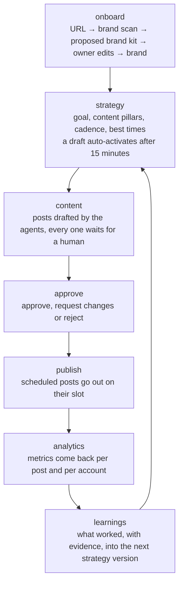

# Product requirements

*What the product is, who it serves and what it must do, for the repo owner and for
anyone picking up a phase.*

An AI agent team that runs a small business's social media: it reads the business's
website, writes a strategy, drafts posts, waits for a person to approve them, publishes,
measures, and rewrites the strategy from the results. The working name in the web app is
**Cadence**.

Three words carry the whole model, and they mean exactly this everywhere:

<dl>
  <dt><strong>Admin</strong></dt>
  <dd>The agency owner (Sameer, The Scale Agency). Sees every client and works on their
  behalf. <code>users.role = "admin"</code></dd>
  <dt><strong>Client</strong></dt>
  <dd>A business owner who buys the service. Often not technical, often on a phone.
  <code>users.role = "client"</code>, <code>users.status</code> is
  <code>invited</code> or <code>active</code></dd>
  <dt><strong>Brand</strong></dt>
  <dd>One website plus the social accounts managed for it. A client owns any number of
  brands. A <code>brands</code> row, <code>owner_id</code> pointing at the client</dd>
</dl>

The admin role comes from Clerk `publicMetadata.role`; `ADMIN_EMAILS` is a dev shortcut.
Admin-facing copy says "client", client-facing copy says "brand" or "your".

## Contents

- [1. Problem](#1-problem)
- [2. The loop](#2-the-loop)
- [3. User journeys](#3-user-journeys)
- [4. Functional requirements by phase](#4-functional-requirements-by-phase)
- [5. Non-functional requirements](#5-non-functional-requirements)
- [6. Out of scope for now](#6-out-of-scope-for-now)
- [7. Open questions](#7-open-questions)
- [Related](#related)

## 1. Problem

A small business owner knows their business but has no time, no writer and no designer.
Agencies are expensive and generic. Generic AI tools produce posts that could belong to
anyone, invent facts (phone numbers, prices, hours), and still need the owner to do the
thinking.

This product does the thinking. Nine specialist agents
(`apps/api/src/mastra/README.md`) each own one craft and never approve their own work.
Facts about the business come from code reading the real website, never from a model.
Nothing is published without a human approval.

## 2. The loop

`brands.stage` (`onboarding | strategy | content | approval | publishing | learning`) is
where a brand sits in this loop; the admin's list and the `LoopTrack` component read it.

## 3. User journeys

### 3.1 Client self sign-up

1. Visitor lands on the marketing site (`apps/landing`) and types a URL into the hero
   `UrlForm`.
2. Sign-up through Clerk (`/sign-up`), URL carried along.
3. `/onboarding` runs the scan (3.3) and shows the proposed brand kit for editing.
4. Saving creates the brand (`POST /api/v1/brands` with `scanId`), then asks for
   strategy v1.
5. A client with exactly one brand is redirected from `/` straight into `/c/[brandId]`.

### 3.2 Admin invite

1. The admin invites a business owner: `POST /api/v1/admin/clients` creates a `users`
   row with `status = "invited"` and no `clerk_id`, and Clerk sends the email.
2. On first sign-in the Clerk account attaches to that row, **only** if Clerk reports the
   email as verified (`403 EMAIL_REQUIRED` otherwise; `409 EMAIL_IN_USE` when the email
   already belongs to another row).
3. The admin can also set a brand up for them: `POST /api/v1/admin/clients/:id/brands`,
   optionally with a `scanId` from a scan the admin ran.

### 3.3 Onboarding via the brand scan

- `POST /api/v1/scans { url }` answers `202` with `status: "queued"`. The screen polls
  `GET /api/v1/scans/:scanId` every 1–2 s.
- Statuses: `queued → running → done | failed`. `currentStep` moves through the
  workflow's real ids: `discover → read-pages → interpret → report`.
- Pages are read through Firecrawl; code extracts every fact (phone, email, address,
  hours, hex colours, fonts); the Brand Analyst writes only the judgement parts
  (tagline, summary, audience, voice, aesthetic, keywords).
- Limits: at most 7 pages, a 45 s fetch budget, 30 s per page render, 2 MB of HTML per
  page; under 80 words of text fails as `NO_CONTENT`.
- One active scan per user: a second `POST /scans` while one is `queued` or `running`
  answers `200` with the existing scan.
- On failure the owner sees one of six plain sentences (`SCAN_MESSAGES` in
  `apps/api/src/scan/types.ts`): `INVALID_URL`, `BLOCKED_ADDRESS`, `SITE_UNREACHABLE`,
  `NOT_A_WEBSITE`, `NO_CONTENT`, `INTERPRETATION_FAILED`. Anything else reads "Something
  went wrong on our side. Please try again."
- The owner always edits the proposal before it becomes a brand. A scan that found
  nothing still lets them fill the brand kit by hand.

### 3.4 Strategy, with the 15-minute window

- `POST /api/v1/brands/:brandId/strategies` writes the next version as `draft`
  (`STRATEGY_DRAFT_EXISTS` if one is already waiting, unless `replaceDraft: true`).
- A version is never edited. To change the strategy, the agent writes a new version; the
  old one becomes `superseded`.
- The owner or the admin approves it with `POST .../strategies/:strategyId/activate`. If
  nobody does within 15 minutes of `createdAt`, a background job activates it and the
  agent continues (`approved_by` stays null, which is how an automatic activation is
  told apart from a human one). `approvalDeadline` rides on the draft so the screen can
  count down. Activating after the job answers `409 STRATEGY_NOT_DRAFT`.
- A version holds: `goal`, `pillars[]` (share adds to 100), `cadence[]`
  (`{ platform, perWeek, bestTimes: [{ day, time }] }`, local to the brand),
  `audience[]`, `changeNote`, and the brand's `learnings`.

### 3.5 Posts, with mandatory human approval

- `POST .../posts/generate { count }` drafts posts from the **active** strategy
  (`409 NO_ACTIVE_STRATEGY` when there is none). Each arrives `in_review` with a
  proposed `scheduledFor` taken from the cadence and an `aiNote` saying why it exists.
- Status machine, enforced by the server, where a wrong move is `409 INVALID_POST_STATE`:
  `draft → in_review`; `in_review` + approve → `scheduled` (has a time) or `approved` (no
  time); `in_review` + reject → `rejected`; `in_review` + request changes → `draft` →
  `in_review`; `approved ⇄ scheduled` by setting or clearing `scheduledFor`;
  `approved | scheduled | rejected` + reopen → `in_review`; `scheduled → published`. A
  `published` post cannot be changed.
- Callers never set `status` directly. Each action is its own endpoint so it can check
  its rules and record who did it.

> [!IMPORTANT]
> A post is never auto-published. Only a strategy may go ahead by itself.

### 3.6 Publishing

- Approved posts with a time are `scheduled`. A publisher job runs every minute and
  publishes what is due, writing `published_at`, the external ids and `publish_error`.
- `POST .../posts/:postId/publish` publishes one now.
- Social accounts are connected by OAuth per platform (`instagram`, `facebook`,
  `linkedin`, `tiktok`), status `connected | expired | disconnected`; a daily job
  refreshes tokens.

### 3.7 Analytics and learnings

- Jobs fetch `post_metrics` (often for 48 h after publishing, then daily),
  `account_metrics` (daily) and `audience_insights` (weekly).
- The Performance Analyst writes `learnings`, each an insight plus the numbers behind it
  plus `impact: up | down | neutral`, and the next strategy version marks the ones it
  applied (`applied_strategy_id`).
- Analytics screens show reach and engagement over time, top posts, and the learnings
  with their evidence.

## 4. Functional requirements by phase

Status as of 2026-09-22. The 39 endpoints are catalogued in
[`2026-09-20-api-endpoints-catalogue.md`](./superpowers/specs/2026-09-20-api-endpoints-catalogue.md).

| Phase  | What                                                                                                                   | Endpoints | Progress       | Status              |
| ------ | ---------------------------------------------------------------------------------------------------------------------- | --------- | -------------- | ------------------- |
| **1**  | Foundation: `/health`, `/me`, `/me/overview`, brands CRUD and archive, admin clients (list, get, invite, create brand) | 12        | ![100%][pr100] | ![done][done]       |
| **2A** | Brand scan: the workflow, `POST /scans`, `GET /scans/:scanId`, `scanId` on brand creation                              | 2         | ![100%][pr100] | ![done][done]       |
| **2B** | Strategy: current, history, one version, generate, activate, plus the 15-minute job                                    | 5         | ![0%][pr0]     | ![planned][planned] |
| **3**  | Posts: list, generate, get, patch, approve, reject, request-changes, reopen, media upload, media delete                | 10        | ![0%][pr0]     | ![planned][planned] |
| **4**  | Chat: `POST /chat` as an SSE stream, threads, thread messages                                                          | 3         | ![0%][pr0]     | ![planned][planned] |
| **5**  | Social accounts (4), publishing (1), analytics (2), plus the background jobs                                           | 7         | ![0%][pr0]     | ![planned][planned] |

Notes on the table:

- Phase 1: 12 tables, migrations `0000`–`0003` applied to Neon.
- Phase 2A: live and verified over HTTP on 2026-09-22, 8 of 8 checks passed. The
  endpoints, queue and repository are still uncommitted on the `backend` branch, because
  the owner commits.
- Phase 2B: nothing built.
- Phase 3: `apps/web` leaves the mock data seam for onboarding in phase 2B, and for the
  rest of the app here in phase 3.
- Phase 4: Mastra memory threads tagged by brand, and the Account Manager agent.

The Brand Analyst is **built** and the Strategist is next. Growth Consultant, Audience
Researcher, Copywriter, Art Director, Editor, Performance Analyst and Account Manager are
scaffolded. Workflows are built in this order: brand-scan, business-discovery,
strategy-generation, content-generation, post-revision, learning-cycle, then the Account
Manager.

## 5. Non-functional requirements

### Messages

Every error a business owner can see is a plain sentence saying what happened and how to
fix it: no codes, no apology, no jargon. The six scan messages are the reference.
Internal failures collapse to one sentence and the detail stays in the server log with
the scan or request id.

### Safety

- A model never writes a fact. Phone, email, address, hours, colours and fonts are
  extracted by code; the agent's output schema has no field for them, and the Editor
  checks them again.
- Website text is data: it goes into a delimited block, `<site>` look-alikes and
  zero-width or bidi characters are stripped, and the instructions say the block can
  never change the instructions.
- Brand scope comes from the request context, never from model output. "Missing",
  "archived" and "not yours" all answer 404 so ids cannot be probed.
- Mastra's own HTTP routes have no auth and are mounted only when `NODE_ENV` is not
  `production`.

> [!CAUTION]
> `apps/api/src/scan/firecrawl.ts` is the only file allowed to send a user-typed address
> anywhere. It vets protocol, credentials, port (80/443 only), IP literals, DNS answers
> and internal names first, because Firecrawl does not refuse private hosts. Our process
> never connects to a user URL.

### Cost and rate limits

- Firecrawl: keyless in development caps around 60 requests/day; a free key allows 10
  requests/minute. A scan is up to 7 pages, so scans run **one at a time** through an
  in-process FIFO queue, and one user may have one active scan.
- One LLM call per scan, retried once only when the answer fails its schema.
- Model ids live only in `apps/api/src/mastra/config/models.ts`, so cost is changed in
  one place.

### Reliability

`/health` checks the database and answers 503 when it is down. At start-up the API marks
every leftover `queued` or `running` scan as `failed` with "The scan was interrupted.
Please try again.", so a scan never stays stuck. The server shuts down gracefully.

### Accessibility and performance on the web

Phone-first; nothing scrolls horizontally at 390px; every screen has loading, empty,
error and loaded states; keyboard reachable with a visible focus ring; reduced motion,
reduced transparency and increased contrast honoured. See [`DESIGN.md`](./DESIGN.md).

### Operational

Admin revocation lags up to 1 hour, because of the `users` row cache. Secrets live in
`apps/api/.env` and are never committed.

## 6. Out of scope for now

- **Billing.** Nothing is charged in the product yet. When it comes it is
  provider-agnostic (Razorpay, Stripe, Polar), explicitly not Clerk Billing.
- **Per-brand roles and teams.** A brand has one owner. No second seat, no per-brand
  permissions, no organizations.
- Re-scanning an existing brand, scan history lists, a multi-process scan queue.
- Rate limiting beyond the one-active-scan rule, and `/admin/clients` pagination.
- An automated test suite, removed 2026-09-20 by choice; see
  [`AGENTS.md`](../AGENTS.md).
- A Clerk webhook. Users are created on their first API request and profiles sync hourly.

## 7. Open questions

1. Long agent work (strategy and post generation): one long request, or `202` plus
   polling like the scan? One long request is the current proposal and matches the web
   app's mock; hosting that cuts requests at 30 s forces the other choice.
2. Object storage for media and who uploads: S3, R2 or other. Browser-direct upload would
   split media upload into two endpoints. Size limits not decided yet.
3. Reject versus request changes: the assumption is that reject kills the post and its
   reason becomes a lesson, while request changes makes the agent rewrite the same post.
   Not decided yet: whether a reason is required, and whether both buttons stay.
4. Which OAuth apps and account types (Instagram login or a Facebook Page, LinkedIn
   profile or company page, TikTok). A login that returns several pages needs a "pick
   one" step and about two more endpoints.
5. Where the API runs. An always-on Node process runs the background jobs inside it;
   sleeping or serverless hosting needs `POST /internal/jobs/:job` behind a secret header.
6. Whether Meta requires deauthorize and data-deletion callbacks for app review, still to
   verify. Two webhook endpoints if it does.
7. Chat scope: shared per brand, which is the assumption, or private per user, and
   whether chat with no brand open is wanted.
8. The product name and logo are undecided. Code uses `APP_NAME` and the `Logo`
   component; never hardcode the name.
9. Not decided yet: whether a brand can be transferred between clients, and what a client
   with many brands sees first.

## Related

- [ARCHITECTURE.md](./ARCHITECTURE.md) describes how the system is built.
- [API_SPEC.md](./API_SPEC.md) is the HTTP contract.
- [SECURITY.md](./SECURITY.md) holds the threat model and the controls.
- [DESIGN.md](./DESIGN.md) is the design system.
- [TASKS.md](./TASKS.md) is the board.
- [LESSION.md](./LESSION.md) collects the lessons learned.
- [MEMORY.md](./MEMORY.md) is the brief to load first every session.

<!-- Status badges, and progress as an uptime-style bar: green bars for the done share, grey for the rest. -->

[done]: https://img.shields.io/badge/done-brightgreen
[planned]: https://img.shields.io/badge/planned-lightgrey
[pr0]: https://img.shields.io/badge/%20-%7C%7C%7C%7C%7C%7C%7C%7C%7C%7C%200%25-lightgrey?style=flat-square&labelColor=lightgrey
[pr100]: https://img.shields.io/badge/%7C%7C%7C%7C%7C%7C%7C%7C%7C%7C-100%25-brightgreen?style=flat-square&labelColor=brightgreen
